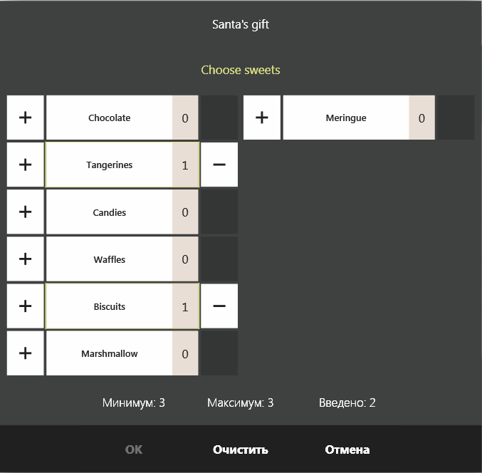
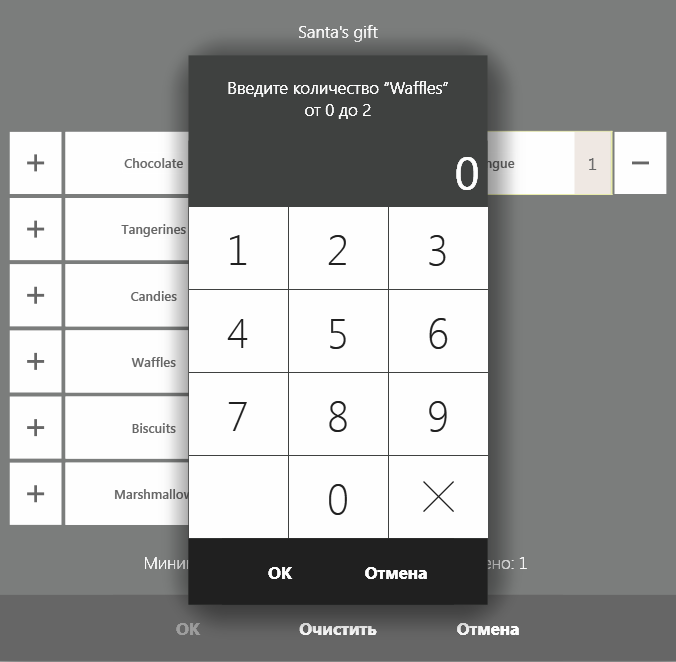

В версии API V7Preview6 было добавлено новое окно для удобства работы с количеством какой-то группы элементов
[`IViewManager.ShowQuantityChangerPopup`](https://iiko.github.io/front.api.sdk/v7/html/M_Resto_Front_Api_UI_IViewManager_ShowQuantityChangerPopup.htm).



Метод принимает

- `string title` — название окна,
- `string text` — текст с описанием,
- `int minimalQuantity` — общее минимально возможное количество для группы,
- `int maximalQuantity` — общее максимально возможное количество для группы,
- `IReadOnlyCollection<(string name, int quantity, int minimalQuantity, int maximalQuantity)> items` — сам список элементов.

Каждый элемент — это

- `string name` — его название,
- `int quantity` — текущее количество элемента,
- `int minimalQuantity` — минимально возможное количество элемента,
- `int maximalQuantity` — максимально возможное количество элемента.

В результате метод возвращает список `IReadOnlyCollection<int>`, в котором содержится количество каждого элемента в порядке, соответствующем порядку в принимаемом аргументе `items`.

Кнопки `+` и `-` позволяют увеличить или уменьшить количество элемента на единицу.
Центральная область элемента с его названием также кликабельна и позволяет открыть цифровой попап для расширенного редактирования количества выбранного элемента.
Справа от названия указано текущее количество элемента.



В случае, когда минимально возможное количество каждого элемента равно нулю,
максимально возможное количество каждого элемента равно максимально возможному количеству для группы,
текущее количество одного из элементов равно максимально возможному количеству для группы,
а текущее количество остальных элементов равно нулю,
клик по центральной области остальных элементов не открывает цифровой попап,
а полностью переносит количество ранее выбранного элемента в текущий элемент.


##### Пример

```cs
private static void ShowListWithQuantitiesPopup(IViewManager viewManager)
{
    const string title = "Santa's gift";
    const string hintText = "Choose sweets";
    var list = new List<(string name, int quantity, int minimalQuantity, int maximalQuantity)>
    {
        ("Chocolate",   0, 0, 3),
        ("Tangerines",  0, 0, 3),
        ("Candies",     0, 0, 3),
        ("Waffles",     0, 0, 3),
        ("Biscuits",    0, 0, 3),
        ("Marshmallow", 0, 0, 3),
        ("Meringue",    0, 0, 3),
    };

    var inputResult = viewManager.ShowQuantityChangerPopup(title, hintText, 3, 3, list);
    ShowNotification(inputResult == null
            ? "Nothing"
            : $"Selected : {string.Join(", ", inputResult.Zip(list, (quantity, item) => (name: item.name, quantity: quantity)).Where(i => i.quantity != 0).Select(i => $"{i.quantity} × {i.name}"))}",
        TimeSpan.FromSeconds(10));
}
```