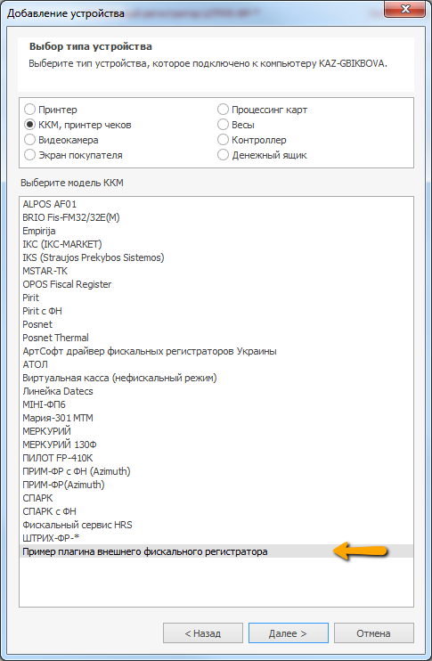
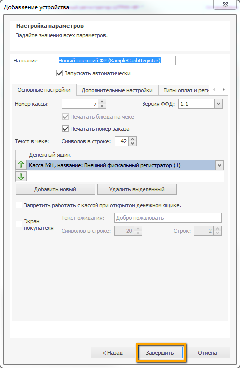
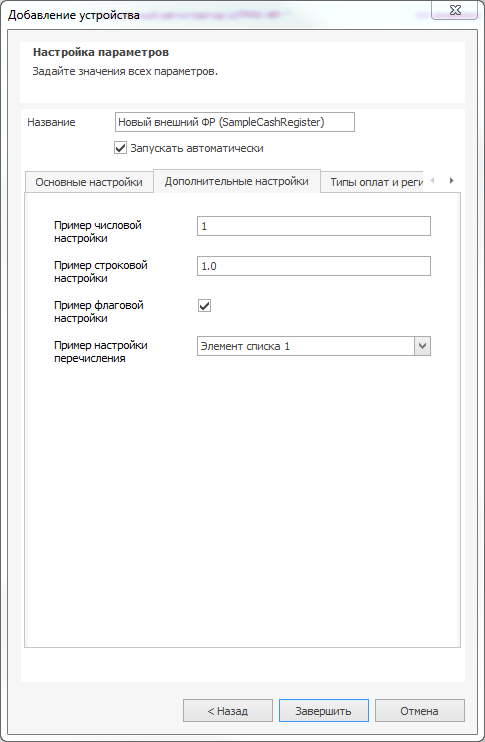
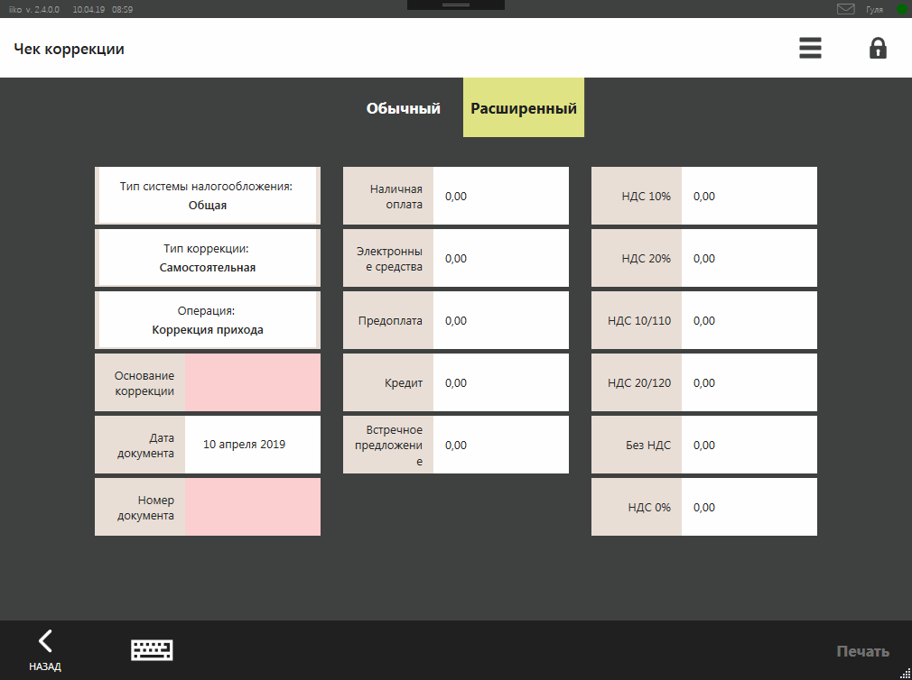
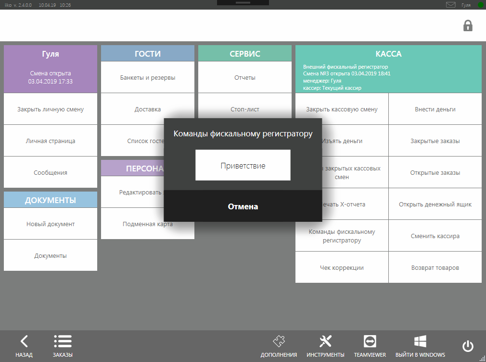
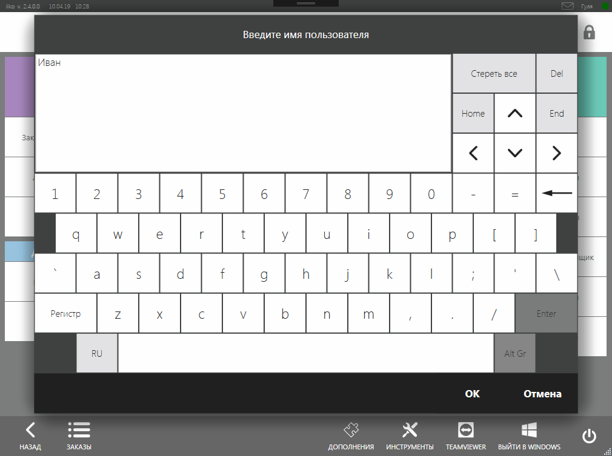
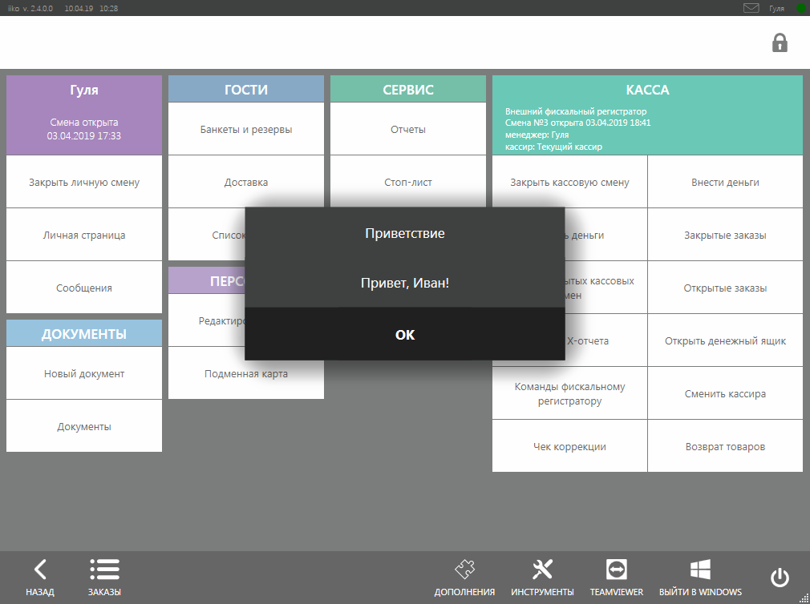

# Внешние фискальные регистраторы
Если в списке поддерживаемых моделей фискальных регистраторов (ФР) в iiko вы не нашли нужной вам модели, вы можете написать свою поддержку интересующей вас модели ФРа. 
Это будет плагин, подключаемый к iikoFront — внешний ФР. 
Cм. [введение](Devices.html).
Для плагинов, реализующих внешние ФРы, вводится [специальное лицензирование](Licensing.html).

## Подключение внешнего фискального регистратора
Подключение внешнего ФРа состоит из 2 шагов.

**Шаг 1:** Зарегистрировать новую модель ФРа.
Для этого нужно реализовать интерфейс [`ICashRegisterFactory`](http://iiko.github.io/front.api.sdk/v6/html/T_Resto_Front_Api_Devices_ICashRegisterFactory.htm) и зарегистрировать его посредством вызова методов API:
```cs
var cashRegisterFactory = new SampleCashRegisterFactory();
PluginContext.Operations.RegisterCashRegisterFactory(cashRegisterFactory);
```
Это нужно для того, чтобы в iikoRMS появилась ваша новая модель ФРа, которую потом можно будет добавить и подключить как контрольно-кассовую технику (ККТ) к кассе.



**Шаг 2:** Добавить ФР новой модели.
Для этого нужно реализовать интерфейс [`ICashRegister`](http://iiko.github.io/front.api.sdk/v6/html/T_Resto_Front_Api_Devices_ICashRegister.htm) и создавать его экземпляр в методе [`ICashRegisterFactory.Create()`](http://iiko.github.io/front.api.sdk/v6/html/M_Resto_Front_Api_Devices_ICashRegisterFactory_Create.htm):
```cs
class SampleCashRegisterFactory : MarshalByRefObject, ICashRegisterFactory
{
    ...
    public ICashRegister Create(Guid deviceId, [NotNull] CashRegisterSettings settings)
    {
        if (settings == null)
            throw new ArgumentNullException(nameof(settings));

        return new SampleCashRegister(deviceId, settings);
    }
}
```
По нажатию «Завершить» в окне добавления ФРа (*iikoOffice => «Настройки оборудования»*), будет вызван метод [`ICashRegisterFactory.Create()`](http://iiko.github.io/front.api.sdk/v6/html/M_Resto_Front_Api_Devices_ICashRegisterFactory_Create.htm), который добавит новый ФР в список оборудования. 
После этого iikoRMS сможет общаться с внешним ФРом, отправлять ему команды и принимать его ответы.



## Настройки фискального регистратора CashRegisterSettings
Каждое оборудование имеет свой набор настроек [`IDeviceFactory.DefaultDeviceSettings`](http://iiko.github.io/front.api.sdk/v6/html/P_Resto_Front_Api_Devices_IDeviceFactory_DefaultDeviceSettings.htm):
```cs
interface IDeviceFactory
{
    ...
    [NotNull]
    DeviceSettings DefaultDeviceSettings { get; }
}
```
##### Произвольные настройки:
В зависимости от модели ФРа, набор настроек может различаться. 
Для этого предусмотрен контейнер произвольных настроек [`DeviceSettings.Settings`](http://iiko.github.io/front.api.sdk/v6/html/T_Resto_Front_Api_Data_Device_Settings_DeviceSettings.htm):
```cs
class DeviceSettings
{
    ...
    List<DeviceSetting> Settings { get; set; }
}
```
###### Варианты настроек:
- **bool** — галочка — [`DeviceBooleanSetting`](http://iiko.github.io/front.api.sdk/v6/html/T_Resto_Front_Api_Data_Device_Settings_DeviceBooleanSetting.htm)
- **string** — текстовое поле — [`DeviceStringSetting`](http://iiko.github.io/front.api.sdk/v6/html/T_Resto_Front_Api_Data_Device_Settings_DeviceStringSetting.htm)
- **number** — числовое поле [`DeviceNumberSetting`](http://iiko.github.io/front.api.sdk/v6/html/T_Resto_Front_Api_Data_Device_Settings_DeviceNumberSetting.htm): 
        — *целое* [`DeviceNumberSettingKind.Integer`](http://iiko.github.io/front.api.sdk/v6/html/T_Resto_Front_Api_Data_Device_Settings_DeviceNumberSettingKind.htm), 
        — *дробное* [`DeviceNumberSettingKind.Decimal`](http://iiko.github.io/front.api.sdk/v6/html/T_Resto_Front_Api_Data_Device_Settings_DeviceNumberSettingKind.htm), 
        — *количественное, со стрелками управления* — [`DeviceNumberSettingKind.Amount`](http://iiko.github.io/front.api.sdk/v6/html/T_Resto_Front_Api_Data_Device_Settings_DeviceNumberSettingKind.htm)
- **enum** — перечисление с заданным набором значений [`DeviceCustomEnumSetting`](http://iiko.github.io/front.api.sdk/v6/html/T_Resto_Front_Api_Data_Device_Settings_DeviceCustomEnumSetting.htm):
        — *выпадающий список* — [`DeviceCustomEnumSetting.IsList = true`](http://iiko.github.io/front.api.sdk/v6/html/P_Resto_Front_Api_Data_Device_Settings_DeviceCustomEnumSetting_IsList.htm)
        — *радиогруппа* — [`DeviceCustomEnumSetting.IsList = false`](http://iiko.github.io/front.api.sdk/v6/html/P_Resto_Front_Api_Data_Device_Settings_DeviceCustomEnumSetting_IsList.htm)
        Значение перечисления описывается типом [`DeviceCustomEnumSettingValue`](http://iiko.github.io/front.api.sdk/v6/html/T_Resto_Front_Api_Data_Device_Settings_DeviceCustomEnumSettingValue.htm).  

Все настройки из коллекции [`DeviceSettings.Settings`](http://iiko.github.io/front.api.sdk/v6/html/T_Resto_Front_Api_Data_Device_Settings_DeviceSettings.htm) при подключении ФРа попадают на вкладку *«Дополнительные настройки»*:



##### Обязательные настройки:
Есть настройки, которые присутствуют в любой модели ФРа. К ним относятся:
- [`CashRegisterSettings.Font0Width`](http://iiko.github.io/front.api.sdk/v6/html/P_Resto_Front_Api_Data_Device_Settings_CashRegisterSettings_Font0Width.htm) — ширина чековой ленты (вкладка *«Основные настройки»*).
- [`CashRegisterSettings.OfdProtocolVersion`](http://iiko.github.io/front.api.sdk/v6/html/P_Resto_Front_Api_Data_Device_Settings_CashRegisterSettings_OfdProtocolVersion.htm) — версия протокола формата фискальных данных, далее ФФД (вкладка *«Основные настройки»*). Актуально только для РФ.
- [`CashRegisterSettings.FiscalRegisterTaxItems`](http://iiko.github.io/front.api.sdk/v6/html/P_Resto_Front_Api_Data_Device_Settings_CashRegisterSettings_FiscalRegisterTaxItems.htm) — список регистров ФРа, соответствующие налоговым категориям (вкладка *«Налоговые категории»*).


- [`CashRegisterSettings.FiscalRegisterTaxItems`](http://iiko.github.io/front.api.sdk/v6/html/P_Resto_Front_Api_Data_Device_Settings_CashRegisterSettings_FiscalRegisterPaymentItem.htm) — список регистров ФРа, соответствующие типам оплат (вкладка *«Типы оплат и регистры»*).


```cs
class CashRegisterSettings : DeviceSettings
{
    [CanBeNull]
    DeviceNumberSetting Font0Width;
    [CanBeNull]
    DeviceCustomEnumSetting OfdProtocolVersion;
    List<FiscalRegisterTaxItem> FiscalRegisterTaxItems;
    List<FiscalRegisterPaymentType> FiscalRegisterPaymentTypes;
}
```

# Взаимодействие iikoFront с внешним фискальным регистратором
Взаимодействие iikoFront с внешним ФРом происходит через интерфейс [`ICashRegister`](http://iiko.github.io/front.api.sdk/v6/html/T_Resto_Front_Api_Devices_ICashRegister.htm).
Именно он отвечает за поведение внешнего ФРа.
К примеру, если в iikoFront происходит оплата заказа, управление придет в команду [`ICashRegister.DoCheque()`](http://iiko.github.io/front.api.sdk/v6/html/M_Resto_Front_Api_Devices_ICashRegister_DoCheque.htm) с необходимыми данными [`ChequeTask`](http://iiko.github.io/front.api.sdk/v6/html/T_Resto_Front_Api_Data_Device_Tasks_ChequeTask.htm) для проведения операции на ФР. iikoFront будет ждать выполнения команды и анализировать ответ ФРа [`CashRegisterResult`](http://iiko.github.io/front.api.sdk/v6/html/T_Resto_Front_Api_Data_Device_Results_CashRegisterResult.htm).

#### Операций ФРа
**1.** [`Setup()`](http://iiko.github.io/front.api.sdk/v6/html/M_Resto_Front_Api_Devices_IDevice_Setup.htm) — установка настроек, конфигураций ФРа. 
Это первая команда, выполняемая плагином. 
Вызывается при добавлении нового ФРа или при редактировании настроек ФРа. 
Основная задача плагина сохранить и применить новые настройки [`CashRegisterSettings`](http://iiko.github.io/front.api.sdk/v6/html/T_Resto_Front_Api_Data_Device_Settings_CashRegisterSettings.htm), которые приходят аргументом.
Чаще всего в этой команде происходит остановка драйвера ФР, применение новых настроек и запуск ФР, если ФР был запущен:
```cs
public void Setup([NotNull] DeviceSettings newSettings)
{
    if (newSettings == null)
        throw new ArgumentNullException(nameof(newSettings));

    Stop();
    Settings = (CashRegisterSettings)newSettings;
    if (newSettings.Autorun && wasConnected)
        Start();
}
```

**2.** [`Start()`](http://iiko.github.io/front.api.sdk/v6/html/M_Resto_Front_Api_Devices_IDevice_Start.htm) — запуск ФРа.
Команда вызывается по нажатию «Запустить» в iikoOffice.
 Также ФР может быть запущен автоматически, если при добавлении устройства в настройках ФР установить флаг «Запускать автоматически».
 


Обычно в этой команде происходит инициализация драйвера, открытие порта, соединение с устройством и тестирование соединения:
```cs
public void Start()
{
    SetState(State.Starting);
    try
    {
        driver = new Driver(); // инициализация драйвера устройства
        driver.Start()
    }
    catch (Exception e)
    {
        PluginContext.Log.Error($"Failed to load driver with error: {e.Message}");
        SetState(State.Stopped);
        throw new DeviceException(e.Message);
    }
    SetState(State.Running);
}
```
**3.** [`Stop()`](http://iiko.github.io/front.api.sdk/v6/html/M_Resto_Front_Api_Devices_IDevice_Stop.htm) — остановка ФРа.
Команда вызывается по нажатию «Остановить» в iikoOffice.
Команда предназначена для остановки устройства, освобождения ресурсов и закрытия портов, например:
```cs
public void  Stop()
{
    SetState(State.Stopping);
    try
    {
        driver?.close();
    }
    catch (Exception e)
    {
        throw new DeviceException(e.Message);
    }
    driver = null;
    SetState(State.Stopped);
}
```
**4.** [`RemoveDevice()`](http://iiko.github.io/front.api.sdk/v6/html/M_Resto_Front_Api_Devices_IDevice_RemoveDevice.htm) — удаление устройства. 
Команда вызывается при выборе «Удалить» в контекстном меню позиции с внешним ФРом в iikoOffice.
Объект ФР в RMS будет помечен удаленным, если выполнение команды не выбросит исключение.

**5.** [`GetDeviceInfo()`](http://iiko.github.io/front.api.sdk/v6/html/M_Resto_Front_Api_Devices_IDevice_GetDeviceInfo.htm) — запрос состояния ФРа.
Команда вызывается каждый раз при открытии вкладки *«Администрирование» => «Настройки оборудования»* или по нажатию кнопки *«Обновить»* на той же вкладке.


Исходя из полученного ответа [`DeviceInfo`](http://iiko.github.io/front.api.sdk/v6/html/T_Resto_Front_Api_Data_Device_Results_DeviceInfo.htm), RMS понимает протокол общения с ФРом: можно ли с ним работать, какие команды можно отправлять ФРу.
Состояние ФРа описывается типом [`DeviceInfo`](http://iiko.github.io/front.api.sdk/v6/html/T_Resto_Front_Api_Data_Device_Results_DeviceInfo.htm), который содержит:
- [`State`](http://iiko.github.io/front.api.sdk/v6/html/P_Resto_Front_Api_Data_Device_Results_DeviceInfo_State.htm) — *состояние ФРа*.
Это может быть *«Running» (запущен)*, *«Stopped» (остановлен)* и прочее.
- [`Comment`](http://iiko.github.io/front.api.sdk/v6/html/P_Resto_Front_Api_Data_Device_Results_DeviceInfo_Comment.htm) — *текстовое описание состояния ФРа*. 
- [`Settings`](http://iiko.github.io/front.api.sdk/v6/html/P_Resto_Front_Api_Data_Device_Results_DeviceInfo_Settings.htm) — *настройки ФРа* [`CashRegisterSettings`](http://iiko.github.io/front.api.sdk/v6/html/T_Resto_Front_Api_Data_Device_Settings_CashRegisterSettings.htm).

Пример реализации запроса состояния подключенного и запущенного устройства:
```cs
public DeviceInfo GetDeviceInfo()
{
    return new DeviceInfo
    {
        State = State.Running,
        Comment = "Работает",
        Settings = currentCashRegisterSettings
    };
}
```
**6.** [`DoOpenSession()`](http://iiko.github.io/front.api.sdk/v6/html/M_Resto_Front_Api_Devices_ICashRegister_DoOpenSession.htm) — открыть кассовую смену (КС). 
Актуально для тех ФРов, драйверы которых имеют команду *«Открыть смену»*.
Например, ФРы ФЗ-54, т.к. нужно указывать имя кассира.
Если ФР не имеет отдельной команды для открытия смены, то нужно вернуть успешный ответ [`CashRegisterResult.Success = true`](http://iiko.github.io/front.api.sdk/v6/html/T_Resto_Front_Api_Data_Device_Results_CashRegisterResult.htm) без выполнения операции в ФР.

**7.** [`DoXReport()`](http://iiko.github.io/front.api.sdk/v6/html/M_Resto_Front_Api_Devices_ICashRegister_DoXReport.htm) — печать X-отчета или его аналога (промежуточный суточный отчет без закрытия смены).
Кассовая смена на iikoFront считается открытой если команда [`DoOpenSession()`](http://iiko.github.io/front.api.sdk/v6/html/M_Resto_Front_Api_Devices_ICashRegister_DoOpenSession.htm) выполнится без исключения, а [`DoXReport()`](http://iiko.github.io/front.api.sdk/v6/html/M_Resto_Front_Api_Devices_ICashRegister_DoXReport.htm) вернет успешный результат: [`CashRegisterResult.Success = true`](http://iiko.github.io/front.api.sdk/v6/html/T_Resto_Front_Api_Data_Device_Results_CashRegisterResult.htm).

**8.** [`DoBillCheque()`](http://iiko.github.io/front.api.sdk/v6/html/M_Resto_Front_Api_Devices_ICashRegister_DoBillCheque.htm) — пречек заказа или отмена пречека.
Команда выполняется на тех ФРах, которые поддерживают печать пречека [`CashRegisterDriverParameters.IsBillTaskSupported = true`](http://iiko.github.io/front.api.sdk/v6/html/T_Resto_Front_Api_Data_Device_Settings_CashRegisterDriverParameters.htm) 
(см. чек типа [`«Счёт»`](https://iiko.github.io/front.api.doc/2019/03/13/bill-chequetask-resolver.html)).

Информация по заказу приходит в аргументе [`BillTask`](http://iiko.github.io/front.api.sdk/v6/html/T_Resto_Front_Api_Data_Device_Tasks_BillTask.htm):
- [`Id`](http://iiko.github.io/front.api.sdk/v6/html/P_Resto_Front_Api_Data_Device_Tasks_CashRegisterTask_Id.htm) — уникальный номер выполняемой операции.
- [`CashierName`](http://iiko.github.io/front.api.sdk/v6/html/P_Resto_Front_Api_Data_Device_Tasks_CashRegisterTask_CashierName.htm) — имя кассира.
- [`CashierId`](http://iiko.github.io/front.api.sdk/v6/html/P_Resto_Front_Api_Data_Device_Tasks_CashRegisterTask_CashierId.htm) — GUID кассира, его идентификатор:
   ```cs
    IUser cashier = PluginContext.Operations.GetUserById(CashierId)
   ```
- [`CashierTaxpayerId`](http://iiko.github.io/front.api.sdk/v6/html/P_Resto_Front_Api_Data_Device_Tasks_CashRegisterTask_CashierTaxpayerId.htm) — ИНН кассира.
- [`IsRefund`](http://iiko.github.io/front.api.sdk/v6/html/P_Resto_Front_Api_Data_Device_Tasks_BillTask_IsRefund.htm) — флаг, который сигнализирует об отмене операции. 
Если на фронте выбрали команду «Возрат заказа», флаг  будет равен "true" и тогда ФР должен будет напечатать чек возврата.
- [`IsCancellation`](http://iiko.github.io/front.api.sdk/v6/html/P_Resto_Front_Api_Data_Device_Tasks_BillTask_IsCancellation.htm) — аннулирование чека, актуально только для Республики Беларусь и Латвии. 
Аннулирование - это отмена ошибочного чека продажи. 
Если кассир делает возврат товара, ФР печатает чек возврата.
Если кассир ошибочно пробил чек, должен напечататься чек аннулирования.
- [`Sales`](http://iiko.github.io/front.api.sdk/v6/html/P_Resto_Front_Api_Data_Device_Tasks_BillTask_Sales.htm) — позиции заказа [`ChequeSale`](http://iiko.github.io/front.api.sdk/v6/html/T_Resto_Front_Api_Data_Device_Tasks_ChequeSale.htm).
Чаще всего это набор информации по блюдам заказа, иногда позиции группируются по НДС. 
Это зависит в частности от ФР, поддерживает ли он ФФД выше 1.0.
- [`СancellingSaleNumber`](http://iiko.github.io/front.api.sdk/v6/html/P_Resto_Front_Api_Data_Device_Tasks_BillTask_СancellingSaleNumber.htm) — номер заказа (актуально только для Республики Беларусь). 
Заполняется, когда идет отмена операции. 
Операций может быть две: пречек заказа и оплата заказа. 
Т.к. тип [`ChequeTask`](http://iiko.github.io/front.api.sdk/v6/html/T_Resto_Front_Api_Data_Device_Tasks_ChequeTask.htm) (см. операцию закрытие заказа) включает в себя тип  [`BillTask`](http://iiko.github.io/front.api.sdk/v6/html/T_Resto_Front_Api_Data_Device_Tasks_BillTask.htm), все текущие поля имеют также отношение и к закрытию заказа.
- [`DiscountSum`](http://iiko.github.io/front.api.sdk/v6/html/P_Resto_Front_Api_Data_Device_Tasks_BillTask_DiscountSum.htm) — общая сумму скидок по всем элементам заказа.
Сюда включены только некатегориальные скидки. 
Это те скидки, которые действуют в целом на заказа, а не на какое-то отдельное блюдо или их категорию.
- [`IncreaseSum`](http://iiko.github.io/front.api.sdk/v6/html/P_Resto_Front_Api_Data_Device_Tasks_BillTask_IncreaseSum.htm) — общуя сумма надбавок по всем элементам заказа. 
Сюда также включены только надбавки, действующие на заказ в целом.
- [`DiscountPercent`](http://iiko.github.io/front.api.sdk/v6/html/P_Resto_Front_Api_Data_Device_Tasks_BillTask_DiscountPercent.htm) — процент скидки на сумму заказа.
Здесь процент скидки или надбавки приводится больше для информации, не стоит на основе их делать какие-либо расчеты, например, пересчитывать скидки. 
```cs
DiscountPercent = (Сумма блюд / DiscountSum) * 100
```
- [`IncreasePercent`](http://iiko.github.io/front.api.sdk/v6/html/P_Resto_Front_Api_Data_Device_Tasks_BillTask_IncreasePercent.htm) — процент надбавки на сумму заказа.
```cs
IncreasePercent = (Сумма блюд / IncreaseSum) * 100
```
- [`ResultSum`](http://iiko.github.io/front.api.sdk/v6/html/P_Resto_Front_Api_Data_Device_Tasks_BillTask_ResultSum.htm) — итоговая сумма заказа с учетом  всех скидок и надбавок. 
Эта сумма получается путем сложения всех стоимостей позиций заказа с учетом НДС, скидок, надбавок, округления. 
Можно представить в виде формулы:
```cs
ResultSum = Сумма блюд - все скидки - Округление(RoundSum) + все надбавки
```
- [`TableNumberLocalized`](http://iiko.github.io/front.api.sdk/v6/html/P_Resto_Front_Api_Data_Device_Tasks_BillTask_TableNumberLocalized.htm) — отформатированная строка с номером стола. Если в настройках ФРа стоит флаг *«Печатать номер заказа»*, то и с номером заказа (пример: «Стол: 10» или «Стол: 10 Заказ: 5»).
- [`OrderNumber`](http://iiko.github.io/front.api.sdk/v6/html/P_Resto_Front_Api_Data_Device_Tasks_BillTask_OrderNumber.htm) — номер заказа.
- [`TableNumber`](http://iiko.github.io/front.api.sdk/v6/html/P_Resto_Front_Api_Data_Device_Tasks_BillTask_TableNumber.htm) — номер стола.
- [`PrintArticle`](http://iiko.github.io/front.api.sdk/v6/html/P_Resto_Front_Api_Data_Device_Tasks_BillTask_PrintArticle.htm) — содержит значение настройки группы торгового предприятия *«Печатать артикул на чеке»* (*«Администрирование» => «Настройки торгового предприятия» => «Группа» => «Настройка типов оплат»*).
- [`TextBeforeCheque`](http://iiko.github.io/front.api.sdk/v6/html/P_Resto_Front_Api_Data_Device_Tasks_BillTask_TextBeforeCheque.htm) — текст добавляемый в начало чека.
Функционал добавления такого текста становится доступным после поддержки интерфейса [`IChequeTaskProcessor`](http://iiko.github.io/front.api.sdk/v6/html/T_Resto_Front_Api_Devices_ChequeTaskProcessor_IChequeTaskProcessor.htm) и его регистрации с помощью команды [`RegisterChequeTaskProcessor()`](http://iiko.github.io/front.api.sdk/v6/html/M_Resto_Front_Api_IOperationService_RegisterChequeTaskProcessor.htm).
- [`TextAfterCheque`](http://iiko.github.io/front.api.sdk/v6/html/P_Resto_Front_Api_Data_Device_Tasks_BillTask_TextAfterCheque.htm) — текст добавляемый в конец чека.

Позиции заказа описываются типом [`ChequeSale`](http://iiko.github.io/front.api.sdk/v6/html/T_Resto_Front_Api_Data_Device_Tasks_ChequeSale.htm):
- [`Name`](http://iiko.github.io/front.api.sdk/v6/html/P_Resto_Front_Api_Data_Device_Tasks_ChequeSale_Name.htm) — наименование позиции (товар, блюдо и прочее).
- [`Code`](http://iiko.github.io/front.api.sdk/v6/html/P_Resto_Front_Api_Data_Device_Tasks_ChequeSale_Code.htm) — артикул позиции.
В некоторых случаях артикул может отсутствовать (в этом случае передается ноль).
Например, печатается чек со сгруппированными по НДС позициям или чек предоплаты.
- [`Price`](http://iiko.github.io/front.api.sdk/v6/html/P_Resto_Front_Api_Data_Device_Tasks_ChequeSale_Price.htm) — цена позиции, без учета скидок и надбавок.
- [`Amount`](http://iiko.github.io/front.api.sdk/v6/html/P_Resto_Front_Api_Data_Device_Tasks_ChequeSale_Amount.htm) — количество позиции.
- [`GuestName`](http://iiko.github.io/front.api.sdk/v6/html/P_Resto_Front_Api_Data_Device_Tasks_ChequeSale_GuestName.htm) — имя гостя, которому соответствует позиция в чеке.
- [`Vat`](http://iiko.github.io/front.api.sdk/v6/html/P_Resto_Front_Api_Data_Device_Tasks_ChequeSale_Vat.htm) — сумма НДС позиции.
- [`Section`](http://iiko.github.io/front.api.sdk/v6/html/P_Resto_Front_Api_Data_Device_Tasks_ChequeSale_Section.htm) — секция ФРа, которому принадлежит блюдо, согласно карте приготовления блюд (*«Администрирование» => «Настройки торгового предприятия» => «Группа» => «Общие настройки» => «Общая карта приготовления блюд»*).
- [`DiscountSum`](http://iiko.github.io/front.api.sdk/v6/html/P_Resto_Front_Api_Data_Device_Tasks_ChequeSale_DiscountSum.htm) — сумма категориальных скидок, которые действуют на данную позицию.
- [`IncreaseSum`](http://iiko.github.io/front.api.sdk/v6/html/P_Resto_Front_Api_Data_Device_Tasks_ChequeSale_IncreaseSum.htm) — сумма категориальных надбавок, которые действуют на данную позицию.
- [`Discount`](http://iiko.github.io/front.api.sdk/v6/html/P_Resto_Front_Api_Data_Device_Tasks_ChequeSale_Discount.htm) — процент скидки на позицию.
```cs
Discount = (Стоимость позиции / DiscountSum) * 100
```
- [`Increase`](http://iiko.github.io/front.api.sdk/v6/html/P_Resto_Front_Api_Data_Device_Tasks_ChequeSale_Increase.htm) — процент надбавки на позицию.
```cs
Increase = (Стоимость позиции / IncreaseSum) * 100
```
- [`Sum`](http://iiko.github.io/front.api.sdk/v6/html/P_Resto_Front_Api_Data_Device_Tasks_ChequeSale_Sum.htm) — итоговая стоимость позиции, с учетом всех скидок и надбавок, как на отдельную позицию, так и на весь чек (категориальные и некатегориальные скидки и надбавки).
```cs
Sum = стоимость позиции - все скидки, действующие на позицию + все надбавки
```
- [`IsTaxable`](http://iiko.github.io/front.api.sdk/v6/html/P_Resto_Front_Api_Data_Device_Tasks_ChequeSale_IsTaxable.htm) — облагается ли позиция налогом (проверяется наличие принадлежности к налоговой категории).
- [`TaxId`](http://iiko.github.io/front.api.sdk/v6/html/P_Resto_Front_Api_Data_Device_Tasks_ChequeSale_TaxId.htm) — идентификатор налоговой ставки в ФР, соответствующая той налоговой категории, которой принадлежит позиция заказа (*«Администрирование» => «Настройки оборудования» => «Настройки ФРа» => «Налоговые категории»).
Если настроено сопоставление налоговых категорий iiko и ФР, то передается идентификатор налоговой ставки, которую указал пользователь.
Если сопоставление не настроено (стоит значение «По умолчанию»), то передается пустая строка.
- [`TransferType`](http://iiko.github.io/front.api.sdk/v6/html/P_Resto_Front_Api_Data_Device_Tasks_ChequeSale_TransferType.htm) — признак способа расчета (аванс (*«Advance»*), оплата (*«FullPayment»*) и прочее).
- [`ItemCategory`](http://iiko.github.io/front.api.sdk/v6/html/P_Resto_Front_Api_Data_Device_Tasks_ChequeSale_ItemCategory.htm) — код признака предмета расчета, который соотвествует позиции, согласно справочнику *«Товары и склады» => «Признаки расчета»*. 
- [`Contractor`](http://iiko.github.io/front.api.sdk/v6/html/P_Resto_Front_Api_Data_Device_Tasks_ChequeSale_Contractor.htm) — комитент/поставщик.
Комитент указывается в настройках группы в таблице *«Общая карта приготовления блюд»* (*«Администрирование» => «Настройки торгового предприятия» => «Группа» => «Общие настройки» => «Общая карта приготовления блюд»*).
- [`GtinCode`](http://iiko.github.io/front.api.sdk/v6/html/P_Resto_Front_Api_Data_Device_Tasks_ChequeSale_GtinCode.htm) — 14-тизначный «Global Trade Item Number» для позиции чека.
- [`ProductId`](http://iiko.github.io/front.api.sdk/v6/html/P_Resto_Front_Api_Data_Device_Tasks_ChequeSale_ProductId.htm) — идентификатор блюда, товара, улуги или другое.
Чтобы получить блюдо:
```cs
PluginContext.Operations.GetProductById(chequeTask.Sales[0].ProductId)
```
После нажатия на «Пречек» на экране заказа, фронт отправляет команду ФРу и ожидает от него ответ [`CashRegisterResult`](http://iiko.github.io/front.api.sdk/v6/html/T_Resto_Front_Api_Data_Device_Results_CashRegisterResult.htm), который состоит из следующего:
- [`Success`](http://iiko.github.io/front.api.sdk/v6/html/P_Resto_Front_Api_Data_Device_Results_PostResult_Success.htm) — true — операция прошла успешно, false — операция не выполнилась или прошла с ошибкой.
- [`Message`](http://iiko.github.io/front.api.sdk/v6/html/P_Resto_Front_Api_Data_Device_Results_PostResult_Message.htm) — текстовое сообщение выполнения команды ФРом. IikoFront выводит данный текст на экран, если операция прошла неуспешно.
- [`CashSum`](http://iiko.github.io/front.api.sdk/v6/html/P_Resto_Front_Api_Data_Device_Results_CashRegisterResult_CashSum.htm) — сумма наличности в кассе на момент запроса.
- [`TotalIncomeSum`](http://iiko.github.io/front.api.sdk/v6/html/P_Resto_Front_Api_Data_Device_Results_CashRegisterResult_TotalIncomeSum.htm) — сумма выручки (наличные + безналичные) в кассе за текущую кассовую смену.
```cs
TotalIncomeSum = сумма продаж - сумма возвратов
```
После закрытия КС или открытия КС [`TotalIncomeSum`](http://iiko.github.io/front.api.sdk/v6/html/P_Resto_Front_Api_Data_Device_Results_CashRegisterResult_TotalIncomeSum.htm) должна быть равна нулю.
- [`Session`](http://iiko.github.io/front.api.sdk/v6/html/P_Resto_Front_Api_Data_Device_Results_CashRegisterResult_Session.htm) — номер смены ФРа.
- [`SerialNumber`](http://iiko.github.io/front.api.sdk/v6/html/P_Resto_Front_Api_Data_Device_Results_CashRegisterResult_SerialNumber.htm) — серийный номер ФРа.
- [`DocumentNumber`](http://iiko.github.io/front.api.sdk/v6/html/P_Resto_Front_Api_Data_Device_Results_CashRegisterResult_DocumentNumber.htm) — номер документа (для ФЗ-54: номер фискального документа) (документами являются открытие смены, внесение, изъятие и прочее).
- [`SaleNumber`](http://iiko.github.io/front.api.sdk/v6/html/P_Resto_Front_Api_Data_Device_Results_CashRegisterResult_SaleNumber.htm) — номер чека (чек: чек продажи, чек возврата).
- [`BillNumber`](http://iiko.github.io/front.api.sdk/v6/html/P_Resto_Front_Api_Data_Device_Results_CashRegisterResult_BillNumber.htm) — номер заказа/счета (актульно для Республики Беларусь).
- [`RtcDateTime `](http://iiko.github.io/front.api.sdk/v6/html/P_Resto_Front_Api_Data_Device_Results_CashRegisterResult_RtcDateTime.htm) — дата и время в ФР.

Так выглядит ответ на большинство команд ФРа, будь то оплата, предоплата, пречек, возврат, печать Z-отчета, печать X-отчета, внесение, изъятие.
В зависимости от содержимого ответа, iikoFront решает выполнилась ли команда на ФР и с каким результатом.
В общем случае, для любой операции с таким ответом, если результат вернулся неуспешным [`Success`](http://iiko.github.io/front.api.sdk/v6/html/P_Resto_Front_Api_Data_Device_Results_PostResult_Success.htm)=*false*, iikoFront выведет ошибку на экран с текстом сообщения [`Message`](http://iiko.github.io/front.api.sdk/v6/html/P_Resto_Front_Api_Data_Device_Results_PostResult_Message.htm) и iikoFront будет считать, что на ФРом команда не была выполнена.
Это не касается проверки на задвоение, которая выполняется при каждой денежной операции (оплата, возврат, внесение, изъятие, предоплата). 
Задача этого механизма не дать выполнить денежную операцию повторно, на тот случай, если ФР вернул ошибку.
iikoFront перед каждой такой операцией будет пытаться выявить несоответствие денежных сумм в ФРе со своими подсчетами. 


Если отрицательный ответ iikoFront обрабатывает одинаково, то успешный результат для каждой операции анализируется по-разному.
Так, в случае пречека, номер счета/заказа будет сохранен в базу iikoFront, при условии, что [`BillNumber`](http://iiko.github.io/front.api.sdk/v6/html/P_Resto_Front_Api_Data_Device_Results_CashRegisterResult_BillNumber.htm) != *null*.

**9.** [`DoCheque()`](http://iiko.github.io/front.api.sdk/v6/html/M_Resto_Front_Api_Devices_ICashRegister_DoCheque.htm) — закрытие заказа, предоплата, возврат.
Команда вызывается при закрытии заказа (по нажатию «Оплатить» на экране кассы) в iikoFront. Вся необходимая информация по заказу, его оплатах, кассире приходит в аргементе [`ChequeTask`](http://iiko.github.io/front.api.sdk/v6/html/T_Resto_Front_Api_Data_Device_Tasks_ChequeTask.htm), который включает в себя описание [`BillTask`](http://iiko.github.io/front.api.sdk/v6/html/T_Resto_Front_Api_Data_Device_Tasks_BillTask.htm) и дополняет его следующими свойствами:
- [`CashPayment`](http://iiko.github.io/front.api.sdk/v6/html/P_Resto_Front_Api_Data_Device_Tasks_ChequeTask_CashPayment.htm) — сумма оплаты наличными.
- [`CardPayments`](http://iiko.github.io/front.api.sdk/v6/html/P_Resto_Front_Api_Data_Device_Tasks_ChequeTask_CardPayments.htm) — список оплат по безналу. 
Оплата по безналу [`ChequeCardPayment`](http://iiko.github.io/front.api.sdk/v6/html/T_Resto_Front_Api_Data_Device_Tasks_ChequeCardPayment.htm) внутри содержит:
   — сумму оплаты [`ChequeCardPayment.Name`](http://iiko.github.io/front.api.sdk/v6/html/P_Resto_Front_Api_Data_Device_Tasks_ChequeCardPayment_Name.htm). 
   — регистр ФРа соответствующий типу оплаты [`ChequeCardPayment.PaymentRegisterId`](http://iiko.github.io/front.api.sdk/v6/html/P_Resto_Front_Api_Data_Device_Tasks_ChequeCardPayment_PaymentRegisterId.htm).
   — признак по-умолчанию — если регистр ФРа не назначался [`ChequeCardPayment.IsDefaultNonCash`](http://iiko.github.io/front.api.sdk/v6/html/P_Resto_Front_Api_Data_Device_Tasks_ChequeCardPayment_IsDefaultNonCash.htm).
- [`CreditSum`](http://iiko.github.io/front.api.sdk/v6/html/P_Resto_Front_Api_Data_Device_Tasks_ChequeTask_CreditSum.htm) — сумма по чеку постоплатой (в кредит).
- [`ConsiderationSum`](http://iiko.github.io/front.api.sdk/v6/html/P_Resto_Front_Api_Data_Device_Tasks_ChequeTask_ConsiderationSum.htm) — сумма по чеку встречным предоставлением.
- [`PrepaymentSum`](http://iiko.github.io/front.api.sdk/v6/html/P_Resto_Front_Api_Data_Device_Tasks_ChequeTask_PrepaymentSum.htm) — сумма по чеку предоплатой (зачетом аванса и (или) предыдущих платежей).

Все вышеперечисленные виды оплат в сумме покрывают стоимость заказа.

- [`RoundSum`](http://iiko.github.io/front.api.sdk/v6/html/P_Resto_Front_Api_Data_Device_Tasks_ChequeTask_RoundSum.htm) — остаток от округления стоимости заказа в пользу клиента.
К примеру, если заказ стоил 100 руб и 20 коп., [`RoundSum`](http://iiko.github.io/front.api.sdk/v6/html/P_Resto_Front_Api_Data_Device_Tasks_ChequeTask_RoundSum.htm) будет равен 20 коп.
Округление не включается в сумму скидок на заказ или на позицию, отображается только в текущем поле.
- [`OrderId`](http://iiko.github.io/front.api.sdk/v6/html/P_Resto_Front_Api_Data_Device_Tasks_ChequeTask_OrderId.htm) — идентификатор заказа. Чтобы получить заказ:
    ```cs
    PluginContext.Operations.GetOrderById(chequeTask.OrderId.Value)
    ```
- [`PrepaymentId`](http://iiko.github.io/front.api.sdk/v7/html/P_Resto_Front_Api_Data_Device_Tasks_ChequeTask_PrepaymentId.htm) — guid оплаты, который позволяет однозначно определить возвращаемый чек. Используется для всех операций предоплат, и нужен для связки предоплаты с возвратом предоплаты, в любой другой операции там будет null. Плагин может вести свою локальную базу операций, записывая туда операции предоплат с необходимыми данными. Таким образом, при выполнении возврата предоплаты он сможет определить конкретную операцию предоплаты и использовать, например, уникальные идентификаторы конкретной операции выполнения возврата по ней.
- [`BillNumber`](http://iiko.github.io/front.api.sdk/v6/html/P_Resto_Front_Api_Data_Device_Tasks_ChequeTask_BillNumber.htm) — фискальный номер чека.
- [`OperationTime`](http://iiko.github.io/front.api.sdk/v6/html/P_Resto_Front_Api_Data_Device_Tasks_ChequeTask_OperationTime.htm) — время закрытия заказа.
- [`IsOfdElectronicChequeOnly`](http://iiko.github.io/front.api.sdk/v6/html/P_Resto_Front_Api_Data_Device_Tasks_ChequeTask_ChequeTask_IsOfdElectronicChequeOnly.htm) — только печать чека, без отправок смс и прочего.
- [`OfdPhoneNumber`](http://iiko.github.io/front.api.sdk/v6/html/P_Resto_Front_Api_Data_Device_Tasks_ChequeTask_OfdPhoneNumber.htm) — номер телефона ОФД для получения копии чека.
- [`OfdEmail`](http://iiko.github.io/front.api.sdk/v6/html/P_Resto_Front_Api_Data_Device_Tasks_ChequeTask_OfdEmail.htm) — email ОФД для получения копии чека.
- [`TaxationSystem`](http://iiko.github.io/front.api.sdk/v6/html/P_Resto_Front_Api_Data_Device_Tasks_ChequeTask_TaxationSystem.htm) — система налогообложения чека.
- [`SettlementAddress`](http://iiko.github.io/front.api.sdk/v6/html/P_Resto_Front_Api_Data_Device_Tasks_ChequeTask_SettlementAddress.htm) — адрес расчета.
Заполняется согласно настройкам ФР *«Администрирование» => «Настройки оборудования» => «Настройки ФРа» => «Дополнительная информация»*.
- [`SettlementPlace`](http://iiko.github.io/front.api.sdk/v6/html/P_Resto_Front_Api_Data_Device_Tasks_ChequeTask_SettlementPlace.htm) — место расчета.
Заполняется согласно настройкам ФР *«Администрирование» => «Настройки оборудования» => «Настройки ФРа» => «Дополнительная информация»*.

При проведении оплат, предоплат, возвратов, внесений, изъятий iikoFront может сверять свои подсчеты денежных сумм по кассовой смене с подсчетами ФРа, это зависит от конфигурации iikoFront, по-умолчанию сверка происходит. Делается это для того, чтобы  избежать возможного дублирования печати чека, который мог все-таки напечататься, даже если вернулся неуспешный результат [`Success`](http://iiko.github.io/front.api.sdk/v6/html/P_Resto_Front_Api_Data_Device_Results_PostResult_Success.htm)=*false*.
Для этого анализируются поля [`CashSum`](http://iiko.github.io/front.api.sdk/v6/html/P_Resto_Front_Api_Data_Device_Results_CashRegisterResult_CashSum.htm) и [`TotalIncomeSum`](http://iiko.github.io/front.api.sdk/v6/html/P_Resto_Front_Api_Data_Device_Results_CashRegisterResult_TotalIncomeSum.htm). 
Также после оплаты iikoFront в БД сохраняет номер документа ФРа [`DocumentNumber`](http://iiko.github.io/front.api.sdk/v6/html/P_Resto_Front_Api_Data_Device_Results_CashRegisterResult_DocumentNumber.htm), потом этот номер можно увидеть в закрытом заказе и номер продажи [`SaleNumber`](http://iiko.github.io/front.api.sdk/v6/html/P_Resto_Front_Api_Data_Device_Results_CashRegisterResult_SaleNumber.htm).

Пример реализации [`DoCheque()`](http://iiko.github.io/front.api.sdk/v6/html/M_Resto_Front_Api_Devices_ICashRegister_DoCheque.htm): 
```cs
public CashRegisterResult DoCheque([NotNull] ChequeTask chequeTask)
{
	if (chequeTask == null)
		throw new ArgumentNullException(nameof(chequeTask));

	if (chequeTask.IsCancellation)
		throw new DeviceException("Чек аннулирования не поддерживается");

	driver.SetCashier(chequeTask.CashierName, chequeTask.CashierTaxpayerId);

	//Отменяем открытие документы, если они есть
	driver.ResetDevice();
	
	//Открыть чек
	if (chequeTask.isRefund)
		driver.OpenRefundCheck();
	else
		driver.OpenSaleCheck()

	//печатаем номер стола и заказа
	driver.PrintText(string.IsNullOrWhiteSpace(chequeTask.TableNumberLocalized)
		? string.Format("Стол: {0}, Заказ № {1}", chequeTask.TableNumber, chequeTask.OrderNumber)
		: chequeTask.TableNumberLocalized);

	//Печатаем дополнительные строки в начале чека
	if (!string.IsNullOrWhiteSpace(chequeTask.TextBeforeCheque))
		driver.PrintText(chequeTask.TextBeforeCheque);

	foreach (var sale in chequeTask.Sales)
	{
		var taxId = GetTaxId(sale); //получаем налоговую ставку
		driver.RegisterItem(sale.Name, sale.Price, sale.Amount, taxId);

		//Регистрируем скидку на позицию
		if (sale.DiscountSum > 0.0m)
			driver.RegisterDiscount(sale.DiscountSum)
		
		//Регистрируем надбавку на позицию
		if (sale.IncreaseSum > 0.0m)
			driver.RegisterIncrease(sale.IncreaseSum);
	}
	
	//Печатает подытог чека
	driver.PrintSubtotal();
	
	//Регистрируем скидку на подытог чека
	if (chequeTask.DiscountSum > 0.0m)
		driver.RegisterSubtotalDiscount(chequeTask.DiscountSum)

	//Регистрируем надбавку на подытог чека
	if (chequeTask.IncreaseSum > 0.0m)
		driver.RegisterSubtotalIncrease(chequeTask.IncreaseSum);

	foreach (var cardPayment in chequeTask.CardPayments)
	{
		var paymentRegisterId = GetPaymentRegisterId(cardPayment); //получить номер типа оплаты
		driver.AddPayment(GetCardPaymentId(cardPayment), cardPayment.Sum);
	}

	cardPayments = chequeTask.CardPayments.Sum(cardPament=>cardPayment.Sum);
	
	if (chequeTask.CashPayment > 0.0m || cardPayments == 0.0m)
	{
		//cashPaymentId - номер типа оплаты для наличных
		driver.AddPayment(cashPaymentId, cardPayment.Sum);
	}

	//Печатаем дополнительные строки в конце чека
	if (!string.IsNullOrWhiteSpace(chequeTask.TextAfterCheque))
		driver.PrintText(chequeTask.TextAfterCheque);

	//Закрываем чек
	driver.CloseCheck();
	return GetCashRegisterData();
}
```


**10.** [`GetCashRegisterData()`](http://iiko.github.io/front.api.sdk/v6/html/M_Resto_Front_Api_Devices_ICashRegister_GetCashRegisterData.htm) — команда запроса данных ФРа. 
Вызывается всегда при фискальных операциях для получения данных по денежным суммам, для получения серийного номера ФРа (если серийный номер менялся в пределах одной КС, iikoFront попросит закрыть КС и открыть новую), или даты и времени на ФРе при открытии смены для их сверки.
Пример реализации [`GetCashRegisterData()`](http://iiko.github.io/front.api.sdk/v6/html/M_Resto_Front_Api_Devices_ICashRegister_GetCashRegisterData.htm):
```cs
public CashRegisterResult GetCashRegisterData()
{
	CheckState(State.Running);
	var totalIncomeSum = driver.GetSalesSum() - driver.GetRefundsSum();
	var cashSum = driver.GetCashSum();
	var serialNumber = driver.GetSerialNumber();
	var sessionNumber = driver.GetSessionNumber();
	var dateTime = driver.GetDateTime();
	var receiptNumber = driver.GetLastReceiptNumber();
	var documentNumber = driver.GetLastDocumentNumber();

	return new CashRegisterResult(cashSum, totalIncomeSum, sessionNumber, serialNumber, receiptNumber, 
								  documentNumber, null, dateTime.ToString(CultureInfo.InvariantCulture));
}
```

**11.** [`GetCashRegisterStatus()`](http://iiko.github.io/front.api.sdk/v6/html/M_Resto_Front_Api_Devices_ICashRegister_GetCashRegisterStatus.htm) — команда запроса состояния ФРа. 
Это состояние отображается в трее iikoFront.
Например, если ФР возвращает режим обслуживания  [`RestaurantMode`](http://iiko.github.io/front.api.sdk/v6/html/P_Resto_Front_Api_Data_Device_Results_CashRegisterStatus_RestaurantMode.htm) и он не совпадает c режимом обслуживания iikoFront, выведется сообщение «Неверный режим ФР». 
Также по [`SessionStatus`](http://iiko.github.io/front.api.sdk/v6/html/P_Resto_Front_Api_Data_Device_Results_CashRegisterStatus_SessionStatus.htm) проверяется просроченность смены. Кроме прочего ФР может выводить сообщение в трей, если:
```cs
    status.Success = false && status.Message != null
```
iikoFront опрашивает состояние ФР каждый раз после выполнения любой фискальной операции.

**12.** [`OpenDrawer()`](http://iiko.github.io/front.api.sdk/v6/html/M_Resto_Front_Api_Devices_ICashRegister_OpenDrawer.htm) — открыть денежный ящик (ДЯ). 
В зависимости от настройки типа оплаты «Открывать денежный ящик», на ФР будет отправлена команда открыть денежный ящик. 

**13.** [`IsDrawerOpened()`](http://iiko.github.io/front.api.sdk/v6/html/M_Resto_Front_Api_Devices_ICashRegister_IsDrawerOpened.htm) — открыт ли денежный ящик.
Если ФР не поддерживает команду получения статуса денежного ящика, то нужно вернуть true.

**14.** [`PrintText()`](http://iiko.github.io/front.api.sdk/v6/html/M_Resto_Front_Api_Devices_ICashRegister_PrintText.htm) — печать нефикального документа. 
Например, печать отчетов, печать штрихкодов для позиций. 
Текст документа будет прислан в команду [`PrintText()`](http://iiko.github.io/front.api.sdk/v6/html/M_Resto_Front_Api_Devices_ICashRegister_PrintText.htm) для печати его на бумаге.

**15.** [`DoPayIn()`](http://iiko.github.io/front.api.sdk/v6/html/M_Resto_Front_Api_Devices_ICashRegister_DoPayIn.htm) — внесение денежной суммы в кассу. 
Информацию по кассиру можно получить так:
```cs
IUser cashier = PluginContext.Operations.GetUserById(cashierId)
```
**16.** [`DoPayOut()`](http://iiko.github.io/front.api.sdk/v6/html/M_Resto_Front_Api_Devices_ICashRegister_DoPayOut.htm) — изъятие денежной суммы из кассы.

**17.** [`DoCorrection()`](http://iiko.github.io/front.api.sdk/v6/html/M_Resto_Front_Api_Devices_ICashRegister_DoCorrection.htm) — печать чека коррекции (*iikoFront => «Доп» => «Чек коррекции»*).
 

По передаваемому объекту [`CorrectionTask`](http://iiko.github.io/front.api.sdk/v6/html/T_Resto_Front_Api_Data_Device_Tasks_CorrectionTask.htm), ФР понимает какой чек корреции нужно провести:
- [`DocumentType`](http://iiko.github.io/front.api.sdk/v6/html/P_Resto_Front_Api_Data_Device_Tasks_CorrectionTask_DocumentType.htm) — признак расчета: 
    — [`CorrectionDocumentType.Sale`](http://iiko.github.io/front.api.sdk/v6/html/T_Resto_Front_Api_Data_Device_Tasks_CorrectionDocumentType.htm) — коррекция прихода,
    — [`CorrectionDocumentType.Buy`](http://iiko.github.io/front.api.sdk/v6/html/T_Resto_Front_Api_Data_Device_Tasks_CorrectionDocumentType.htm) — коррекция расхода.
- [`CorrectionReason`](http://iiko.github.io/front.api.sdk/v6/html/P_Resto_Front_Api_Data_Device_Tasks_CorrectionTask_CorrectionReason.htm) — тип коррекции:
    — [`CorrectionReasonEnum.OwnInitiative`](http://iiko.github.io/front.api.sdk/v6/html/T_Resto_Front_Api_Data_Device_Tasks_CorrectionReasonEnum.htm) — самостоятельная,
    — [`CorrectionReasonEnum.Determination`](http://iiko.github.io/front.api.sdk/v6/html/T_Resto_Front_Api_Data_Device_Tasks_CorrectionReasonEnum.htm) — по предписанию.
- [`CashSum`](http://iiko.github.io/front.api.sdk/v6/html/P_Resto_Front_Api_Data_Device_Tasks_CorrectionTask_CashSum.htm) — сумма по чеку наличными.
- [`NonCashSum`](http://iiko.github.io/front.api.sdk/v6/html/P_Resto_Front_Api_Data_Device_Tasks_CorrectionTask_NonCashSum.htm) — электронные средства.
- [`PrepaymentSum`](http://iiko.github.io/front.api.sdk/v6/html/P_Resto_Front_Api_Data_Device_Tasks_CorrectionTask_PrepaymentSum.htm) — предоплата.
- [`CreditSum`](http://iiko.github.io/front.api.sdk/v6/html/P_Resto_Front_Api_Data_Device_Tasks_CorrectionTask_CreditSum.htm) — оплата в кредит.
- [`ConsiderationSum`](http://iiko.github.io/front.api.sdk/v6/html/P_Resto_Front_Api_Data_Device_Tasks_CorrectionTask_ConsiderationSum.htm) — оплата встречным предложением.
- [`DocumentDateTime`](http://iiko.github.io/front.api.sdk/v6/html/P_Resto_Front_Api_Data_Device_Tasks_CorrectionTask_DocumentDateTime.htm) — дата документа основания для коррекции в формате ГГГГ-ММ-ДД.
- [`DocumentNumber`](http://iiko.github.io/front.api.sdk/v6/html/P_Resto_Front_Api_Data_Device_Tasks_CorrectionTask_DocumentNumber.htm) -номер документа основания для коррекции.
- [`DocumentName`](http://iiko.github.io/front.api.sdk/v6/html/P_Resto_Front_Api_Data_Device_Tasks_CorrectionTask_DocumentName.htm) — наименование документа-основания для коррекции.
- [`TaxationSystem`](http://iiko.github.io/front.api.sdk/v6/html/P_Resto_Front_Api_Data_Device_Tasks_CorrectionTask_TaxationSystem.htm) — применяемая система налогообложения.
- [`VatSum`](http://iiko.github.io/front.api.sdk/v6/html/P_Resto_Front_Api_Data_Device_Tasks_CorrectionTask_VatSum.htm) — корректируемые суммы НДС (сумма НДС чека по ставке 18%, 10%, 18/118, 10/110, 0%, без НДС). [`CashRegisterVatData`](http://iiko.github.io/front.api.sdk/v6/html/T_Resto_Front_Api_Data_Device_Results_CashRegisterVatData.htm): [`TaxAmount`](http://iiko.github.io/front.api.sdk/v6/html/P_Resto_Front_Api_Data_Device_Results_CashRegisterVatData_TaxAmount.htm) — рассчитанная сумма НДС и [`TaxableSum`](http://iiko.github.io/front.api.sdk/v6/html/P_Resto_Front_Api_Data_Device_Results_CashRegisterVatData_TaxableSum.htm) — сумма расчета (для НДС 0 и без НДС).

**18.** [`DoZReport()`](http://iiko.github.io/front.api.sdk/v6/html/M_Resto_Front_Api_Devices_ICashRegister_DoZReport.htm) — закрыть кассовую смену на ФРе. 
Кассовая смена на iikoFront считается закрытой если команда DoZReport() вернет успешный результат: CashRegisterResult.Success = true.

**19.** [`GetQueryInfo()`](http://iiko.github.io/front.api.sdk/v6/html/M_Resto_Front_Api_Devices_ICashRegister_GetQueryInfo.htm) — запрос на расширенные команды ФРа. 
С помощью команд [`GetQueryInfo()`](http://iiko.github.io/front.api.sdk/v6/html/M_Resto_Front_Api_Devices_ICashRegister_GetQueryInfo.htm) и [`DirectIo()`](http://iiko.github.io/front.api.sdk/v6/html/M_Resto_Front_Api_Devices_ICashRegister_DirectIo.htm) ФР может на свое усмотрение добавлять свои команды, которые можно будет вызывать из iikoFront «Доп» => «Команды фискальному регистратору»*.
Метод [`GetQueryInfo()`](http://iiko.github.io/front.api.sdk/v6/html/M_Resto_Front_Api_Devices_ICashRegister_GetQueryInfo.htm) возвращает описание произвольных команд ФР, а [`DirectIo()`](http://iiko.github.io/front.api.sdk/v6/html/M_Resto_Front_Api_Devices_ICashRegister_DirectIo.htm) выполняет их.
Пример — приветствие пользователя:
```cs
public QueryInfoResult GetQueryInfo()
{
    var supportedCommands = new List<SupportedCommand>
    {
        // команда приветствия пользователя с кодовым именем "HelloWorld"
        new SupportedCommand("HelloWorld", "Приветствие")
        {
            // параметры ввода
            Parameters = new List<RequiredParameter>
            {
                // поле для ввода имени пользователя
                new RequiredParameter("UserName", "Имя пользователя", "Введите имя пользователя", "string")
            }
        }
    };

    var result = new QueryInfoResult
    {
        SupportedCommands = supportedCommands
    };

    return result;
}
```
```cs
public DirectIoResult DirectIo(CommandExecute command)
{
    if (command == null)
        throw new ArgumentNullException(nameof(command));

    var result = new DirectIoResult { Document = new Document { Lines = new List<string>() } };

    // находим команду приветствия пользователя по кодовому имени "HelloWorld" 
    if (command.Name == "HelloWorld")
    {
        // считываем данные из параметра ввода имени пользователя
        const string paramName = "UserName";
        var userName = command.Parameters.FirstOrDefault(item => item.Name == paramName)?.Value;
        
        // записываем приветственное сообщение
        result.Message = userName != null ? $"Привет, {userName}!" : "Привет всем!";
    }

    return result;
}
```
Выбор команды ФРа:



Ввод имени пользователя:



Приветствие пользователя:



Таким образом, плагин может запрашивать какие-то данные у пользователя, выводить сообщения, отображать на UI документы. 
[`QueryInfoResult`](http://iiko.github.io/front.api.sdk/v6/html/T_Resto_Front_Api_Data_Device_Results_QueryInfoResult.htm):
- [`SupportedCommands`](http://iiko.github.io/front.api.sdk/v6/html/P_Resto_Front_Api_Data_Device_Results_QueryInfoResult_SupportedCommands.htm) — список поддерживаемых команды ФРа сверх протокола. [`SupportedCommand`](http://iiko.github.io/front.api.sdk/v6/html/T_Resto_Front_Api_Data_Device_Tasks_SupportedCommand.htm) содержит:
    —  [`Name`](http://iiko.github.io/front.api.sdk/v6/html/P_Resto_Front_Api_Data_Device_Tasks_SupportedCommand_Name.htm) — кодовое имя команды.
    —  [`ResourceName`](http://iiko.github.io/front.api.sdk/v6/html/P_Resto_Front_Api_Data_Device_Tasks_SupportedCommand_ResourceName.htm) — отображаемое имя команды.
    —  [`Parameters`](http://iiko.github.io/front.api.sdk/v6/html/P_Resto_Front_Api_Data_Device_Tasks_SupportedCommand_Parameters.htm) — поля ввода информации, где [`RequiredParameter.Type`](http://iiko.github.io/front.api.sdk/v6/html/P_Resto_Front_Api_Data_Device_Tasks_RequiredParameter_Type.htm) может быть: *"bool", "string", "int", "datetime", "double"*. 
	От этого зависит тип ввода поля: текст, ввод целого числа, ввод дробного числа, флаг, ввод даты.

**20.** [`DirectIo()`](http://iiko.github.io/front.api.sdk/v6/html/M_Resto_Front_Api_Devices_ICashRegister_DirectIo.htm) — выполнение произвольной команды ФРа.
Если команда возвращает заполненный [`DirectIoResult.Document`](http://iiko.github.io/front.api.sdk/v6/html/P_Resto_Front_Api_Data_Device_Results_DirectIoResult_Document.htm), этот документ будет отображен на экране iikoFront.

**21.** [`GetCashRegisterDriverParameters()`](http://iiko.github.io/front.api.sdk/v6/html/M_Resto_Front_Api_Devices_ICashRegister_GetCashRegisterDriverParameters.htm) — настройки драйвера ФРа.
Пример:
```cs
public CashRegisterDriverParameters GetCashRegisterDriverParameters()
{
    return new CashRegisterDriverParameters
    {
        CanPrintText = true, \\ Поддерживает ли ККМ печать текста
        SupportsPayInAfterSessionClose = true, \\ Поддерживает ли ККМ внесение при закрытой кассовой смене
        CanPrintBarcode = true, \\ Поддерживает ли ККМ печать простых штрихкодов
        CanPrintQRCode = true, \\ Поддерживает ли ККМ печать QR-кодов
        CanUseFontSizes = true, \\ Поддерживает ли ККМ использование шрифтов для печати текста
        Font0Width = 44, \\ Ширина строки шрифтом F0
        Font1Width = 42,\\ Ширина строки шрифтом F1
        Font2Width = 22,\\ Ширина строки шрифтом F2
        IsCancellationSupported = true, \\ Поддерживает ли ФР операцию Аннулирования
        ZeroCashOnClose = false, \\ Обнуляет ли ККМ сумму наличных в кассе при закрытии смены
        IsBillTaskSupported = false, \\ Поддерживается ли ФР печать пречека через команду «Счет»
    };
}
```
Как правило, эти настройки считываются с драйвера устройства после его запуска, т.к. до запуска они еще не известны. 
От этих настроек iikoFront понимает умеет ли ФР печатать текст, может ли вносить деньги в закрытую КС, поддерживает ли печать QR-кодов и т.д.


# FAQ
**1. Почему не появляется в списке моделей внешний ФР?**

*Вариант 1*: Скорее всего регистрация внешнего ФР прошла неуспешно. Это можно проверить по логам *api.log* в папке с данными фронта. 
Наличие следующих записей говорит об успехе регистрации внешнего ФРа:
```cs
[2019-04-05 14:58:52,546] DEBUG [48] — Plugin “CashRegisterPluginFolderName” connected.
[2019-04-05 14:58:52,731] DEBUG [48] — Plugin “CashRegisterPluginFolderName” is calling RegisterCashRegisterFactory operation
[2019-04-05 14:58:52,791]  INFO [48] — Device factory: "CodeName" added.
```
*CashRegisterPluginFolderName* — имя папки c плагином `iikoFront/Plugins/CashRegisterPluginFolderName`
*CodeName* — [`DeviceSettings.CodeName`](http://iiko.github.io/front.api.sdk/v6/html/P_Resto_Front_Api_Devices_IDeviceFactory_CodeName.htm)
Иначе, в логах будет зафиксировано исключение.

*Вариант 2*: Обновить вкладку с настройками оборудования в iikoOffice: *«Администрирование»* => *«Настройка оборудования»* => кнопка *«Обновить»*. 
Если вкладка была уже открыта до запуска iikoFront, то список доступных моделей оборудования не был обновлен автоматически, его нужно обновлять вручную или переоткрыть вкладку.

**2. Как по идентификатору кассира Guid cashierId получить имя кассира?**
```cs
IUser user = PluginContext.Operations.GetUserById(cashierId);
var name = user.Name;
```
**3. Как сконфигурировать типы внесений и изъятий в iikoOffice, чтобы вызывались методы ФРа DoPayIn() и DoPayOut() ?**

Скорее всего настроены нефискальные внесения и изъятия. 
Это просто бухгалтерские перемещения, которые не вызывают команды ФРа на их печать.
Фискальные внесения и изъятия должны иметь пустой Шеф-счёт. 
См. [`документацию`](https://ru.iiko.help/articles/#!iikooffice-5-4/topic-102) iiko про «Типы внесений и изъятий п.4».
