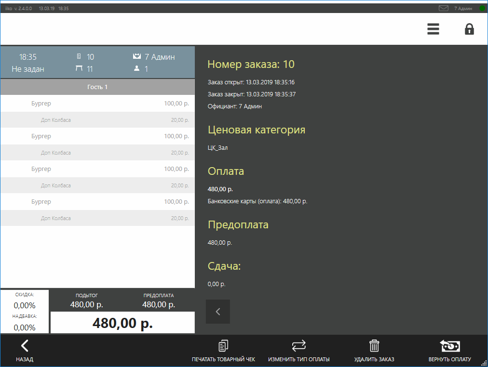
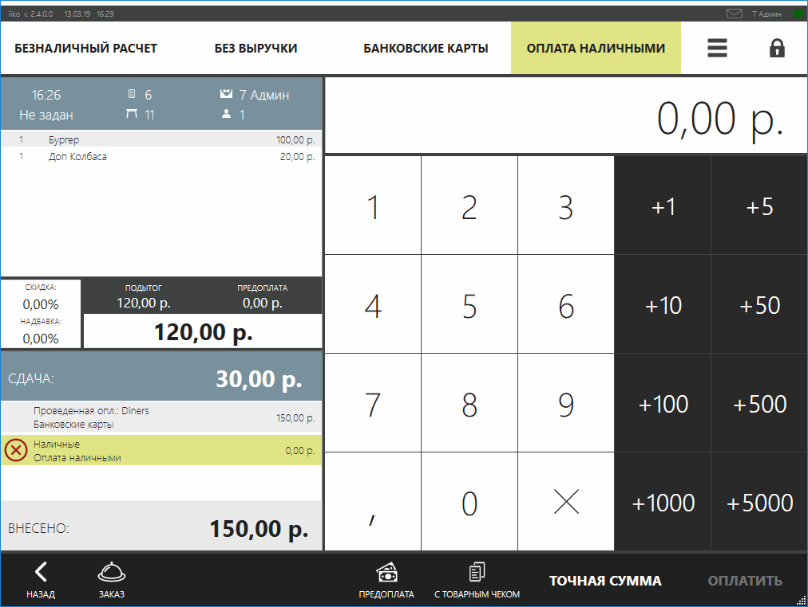
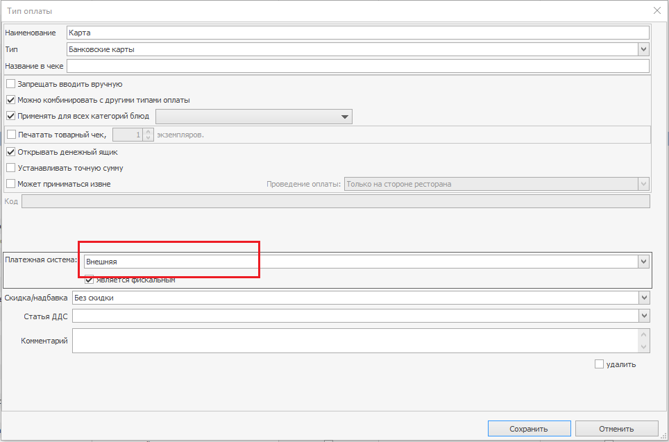

## Добавление оплат
Для добавления оплаты в заказ существуют методы:

- [IEditSession.AddPaymentItem](https://iiko.github.io/front.api.sdk/v6/html/Overload_Resto_Front_Api_V6_Editors_IEditSession_AddPaymentItem.htm) &mdash; добавить оплату

- [IEditSession.AddExternalPaymentItem](https://iiko.github.io/front.api.sdk/v6/html/Overload_Resto_Front_Api_V6_Editors_IEditSession_AddExternalPaymentItem.htm) &mdash; добавить внешнюю оплату

- [IEditSession.AddPreliminaryPaymentItem](https://iiko.github.io/front.api.sdk/v6/html/Overload_Resto_Front_Api_V6_Editors_IEditSession_AddPreliminaryPaymentItem.htm) &mdash; добавить предварительную оплату _(имеет смысл только для заказов доставки)_

Также можно использовать одноименные [методы](https://iiko.github.io/front.api.sdk/v6/html/Methods_T_Resto_Front_Api_V6_Extensions_OperationServiceExtensions.htm) сервиса операций&ndash;расширений, в которых неявно создаётся [сессия редактирования]({{ site.baseurl }}/v6/ru/Data%20editing.html)
(_отличие в необходимости выполнения нескольких действий над заказом.
Если помимо добавления оплаты требуется, например, добавить гостя к заказу, то нужно использовать методы в рамках сессии редактирования_).
Для настройки и регистрации внешних типов оплаты см. статью [Интеграция с внешними типами оплаты](PaymentProcessor.html).

##### Ограничения добавления оплат:
Платеж может быть добавлен в заказ, только если заказ находится в статусе новый (`New`) или пречек (`Bill`), иначе метод выбрасывает исключение [`ConstraintViolationException`](http://iiko.github.io/front.api.sdk/v6/html/T_Resto_Front_Api_V6_Exceptions_ConstraintViolationException.htm).
Кроме того нельзя добавить в заказ несколько непроведенных элементов оплаты одного типа
(_NOTE: планируется разрешить добавлять несколько непроведенных элементов оплаты в заказ_).

##### Примеры

- Добавление в заказ оплаты наличными
```cs
var order = PluginContext.Operations.GetOrders().Last(o => o.Status == OrderStatus.New);
var paymentType = PluginContext.Operations.GetPaymentTypes().Last(x => x.Kind == PaymentTypeKind.Cash);
var credentials = PluginContext.Operations.GetCredentials();
var paymentItem = PluginContext.Operations.AddPaymentItem(100m, null, paymentType, order);
```
- Добавление в доставочный заказ оплаты картой
```cs
var deliveryOrder = PluginContext.Operations.GetDeliveryOrders().Last(o => o.Status == OrderStatus.New);
var paymentType = PluginContext.Operations.GetPaymentTypes().Last(x => x.Kind == PaymentTypeKind.Card && x.Name.ToUpper() == "DINERS");
var additionalData = new CardPaymentItemAdditionalData { CardNumber = "123456" };
PluginContext.Operations.AddPreliminaryPaymentItem(150, additionalData, paymentType, deliveryOrder, PluginContext.Operations.GetCredentials());
```
- Добавить в заказ внешнюю непроведенную оплату
```cs
var order = PluginContext.Operations.GetOrders().Last(o => o.Status == OrderStatus.New);
var paymentType = PluginContext.Operations.GetPaymentTypes().Last(x => x.Kind == PaymentTypeKind.Card && x.Name.ToUpper() == "DINERS");
var additionalData = new CardPaymentItemAdditionalData { CardNumber = "123456" };
PluginContext.Operations.AddExternalPaymentItem(150, false, additionalData, paymentType, order, PluginContext.Operations.GetCredentials());
```


Комментарии:
- В примерах используется выражение `PluginContext.Operations.GetOrders().Last(...)` &mdash; получение последнего попавшегося заказа из списка.
Для решения бизнес&ndash;задач следует использовать соответствующий критерий отбора.
- `PluginContext.Operations.GetCredentials()` &mdash; здесь и далее в примерах приводится метод&ndash;расширение, [реализованный](https://github.com/iiko/front.api.sdk/blob/master/sample/Resto.Front.Api.SamplePlugin/OperationServiceExtensions.cs) в примере проекта SamplePlugin.

## Оплата заказа
Для оплаты заказа существуют методы:

- [IOperationService.PayOrder](https://iiko.github.io/front.api.sdk/v6/html/M_Resto_Front_Api_V6_IOperationService_PayOrder.htm) &mdash; оплата заказа

- [IOperationService.PayOrderAndPayOutOnUser](https://iiko.github.io/front.api.sdk/v6/html/M_Resto_Front_Api_V6_IOperationService_PayOrderAndPayOutOnUser.htm) &mdash; оплата заказа в расчет официанту

также существует метод, с помощью которого можно превратить элемент оплаты в предоплату iikoFront
- [IOperationService.ProcessPrepay](https://iiko.github.io/front.api.sdk/v6/html/M_Resto_Front_Api_V6_IOperationService_ProcessPrepay.htm)

 Если оплата производится фискальным наличным типом, то на пользователя, от чьего имени производится операция оплаты методом `IOperationService.PayOrderAndPayOutOnUser`, будет оформлено [фискальное изъятие](https://ru.iiko.help/articles/iikofront-6-3/topic-43).

#### Примеры

##### Оплата заказа, в котором достаточно внесенных денежных средств

Пусть существует заказ IOrder order, который необходимо закрыть в iikoFront и в заказ уже внесено достаточно проведенных оплат
(*проведенные элементы оплаты это либо предоплаты, внесенные на экране кассы iikoFront, либо оплаты, добавленные по инициативе плагина методом `AddExternalPaymentItem` с флагом `isProcessed` равным `true`*).
Для такого заказа можно вызвать метод:
```cs
operationService.PayOrder(credentials, order);
```



##### Оплата заказа наличными с расчетом официанту

Пусть существует заказ `IOrder order`, который необходимо оплатить наличными на всю сумму заказа и закрыть в iikoFront.
Для этого нужно выбрать соответствующий `paymentType`.
Затем вызывается метод `IOperationService.PayOrderAndPayOutOnUser`.
В примере ниже заказ оплачивается наличными на всю сумму заказа:
```cs
var order = PluginContext.Operations.GetOrders().Last(o => o.Status == OrderStatus.New || o.Status == OrderStatus.Bill);
var credentials = PluginContext.Operations.AuthenticateByPin("777");
var paymentType = operationService.GetPaymentTypesToPayOutOnUser().First(x => x.IsCash);
PluginContext.Operations.PayOrderAndPayOutOnUser(credentials, order, paymentType, order.ResultSum);
```

##### Оплата плагинным типом оплаты

Пусть существует `IOrder order` который нужно оплатить плагинным типом оплаты.

```cs
var order = PluginContext.Operations.GetOrders().Last(o => o.Status == OrderStatus.New);
var paymentType = PluginContext.Operations.GetPaymentTypes().Single(i => i.Kind== PaymentTypeKind.External && i.Name == "SamplePaymentType");
var credentials = PluginContext.Operations.GetCredentials();
PluginContext.Operations.PayOrderAndPayOutOnUser(credentials, order, paymentType, order.ResultSum);
```

##### Комментарии:
- При оплате заказа на главной кассе (в кассовую смену главной кассы) с помощью методов [IOperationService.PayOrder](https://iiko.github.io/front.api.sdk/v6/html/M_Resto_Front_Api_V6_IOperationService_PayOrder.htm) или
 [IOperationService.PayOrderAndPayOutOnUser](https://iiko.github.io/front.api.sdk/v6/html/M_Resto_Front_Api_V6_IOperationService_PayOrderAndPayOutOnUser.htm) заказ закроется, распечатаются все необходимые квитанции, будет напечатан фискальный чек, а сам заказ окажется в закрытых в iikoFront (_NOTE: дополнить раздел пояснением про фискальное изъятие в расчет официанту_).

### Возврат оплаты
Возврат оплаты и возврат заказов по инициативе плагина пока не реализован, поэтому должен выполняться со стационарных терминалов iikoFront пользователем системы.

### Проведение оплаты

#### Добавление в заказ оплаты, проведенной на внешней стороне
В некоторых случаях требуется добавить такой элемент оплаты в заказ, обработка которого уже выполнена вне iikoFront.
Для этого используется метод `AddExternalPaymentItem`, которому в параметре `isProcessed` передается значение `true`.
В данном случае iikoFront считает, что необходимые транзакции, связанные с элементом оплаты, были выполнены вовне.
Поэтому со своей стороны не предпринимает действий по обработке и помечает данный элемент оплаты проведенным.

##### Пример
```cs
var order = PluginContext.Operations.GetOrders().Last(o => o.Status == OrderStatus.New);
var paymentType = PluginContext.Operations.GetPaymentTypes().Last(x => x.Kind == PaymentTypeKind.Cash);
PluginContext.Operations.AddExternalPaymentItem(150, true, null, paymentType, order, PluginContext.Operations.GetCredentials());
```



#### Добавление в заказ проведенной оплаты и превращение ее в предоплату iikoFront

Иногда требуется в заказ добавить такой элемент оплаты, чтобы он отображался в отчетах iikoOffice до закрытия заказа.
Тогда в заказ нужно добавить оплату методом `AddExternalPaymentItem` с параметром `isProcessed` равным `true`, затем вызвать метод [IOperationService.ProcessPrepay](https://iiko.github.io/front.api.sdk/v6/html/M_Resto_Front_Api_V6_IOperationService_ProcessPrepay.htm).

##### Пример
```cs
var order = PluginContext.Operations.GetOrders().Last(o => o.Status == OrderStatus.New);
var paymentType = PluginContext.Operations.GetPaymentTypes().Last(x > x.Kind == PaymentTypeKind.Card && x.Name.ToUpper() == "DINERS");
var additionalData = new CardPaymentItemAdditionalData { CardNumber  "123456" };
var credentials = PluginContext.Operations.GetCredentials();
var paymentItem = PluginContext.Operations.AddExternalPaymentItem(150, true, additionalData, paymentType, order, credentials);
order = PluginContext.Operations.GetOrderById(order.Id);
PluginContext.Operations.ProcessPrepay(credentials, order, paymentItem);
```


#### Добавление в заказ предварительного платежа с последующим превращением в предоплату iikoFront

Для оплаты доставочного заказа следует сначала добавить предварительную оплату с помощью метода [IEditSession.AddPreliminaryPaymentItem](https://iiko.github.io/front.api.sdk/v6/html/Overload_Resto_Front_Api_V6_Editors_IEditSession_AddPreliminaryPaymentItem.htm), а после вызвать метод [IOperationService.ProcessPrepay](https://iiko.github.io/front.api.sdk/v6/html/M_Resto_Front_Api_V6_IOperationService_ProcessPrepay.htm).

##### Пример
```cs
var order = PluginContext.Operations.GetDeliveryOrders().Last(o => o.Status == OrderStatus.New || o.Status == OrderStatus.Bill);
var paymentType = PluginContext.Operations.GetPaymentTypes().Last(i => i.Kind == PaymentTypeKind.Cash);
var credentials = PluginContext.Operations.GetCredentials();
var paymentItem = PluginContext.Operations.AddPreliminaryPaymentItem(order.ResultSum, null, paymentType, order, credentials);
PluginContext.Operations.ProcessPrepay(credentials, PluginContext.Operations.GetDeliveryOrderById(order.Id), paymentItem);
```

## Типы оплат, которые поддерживают Silent-оплату
Если для оплаты заказа не требуется взаимодействие с пользовательским интерфейсом iikoFront(например для сбора данных) или если все необходимые данные уже собраны, то без участия пользователя iikoFront оплачивать заказ, добавлять предоплату или чаевые в заказ можно по инициативе плагина следующими типами оплаты:
- Наличные
- Банковские карты, платежная система которых в задана как "Внешняя".
Настройка платежной системы типа оплаты в iikoOffice должна быть следующей:

- Внешние типы оплаты, которые поддерживают Silent-оплату

**Дополнительно:**
- Добавление чаевых в заказ см. в разделе [Чаевые](Donations.html).
- Silent-оплата внешним типом оплаты см. в разделе [Внешние типы оплаты](PaymentProcessor.html).

## Удаление оплат

- [IEditSession.DeletePaymentItem](https://iiko.github.io/front.api.sdk/v6/html/M_Resto_Front_Api_V6_Editors_IEditSession_DeletePaymentItem.htm) &mdash; удалить оплату

- [IEditSession.DeleteExternalPaymentItem](https://iiko.github.io/front.api.sdk/v6/html/M_Resto_Front_Api_V6_Editors_IEditSession_DeleteExternalPaymentItem.htm) &mdash; удалить внешнюю оплату

- [IEditSession.DeletePreliminaryPaymentItem](https://iiko.github.io/front.api.sdk/v6/html/M_Resto_Front_Api_V6_Editors_IEditSession_DeletePreliminaryPaymentItem.htm) &mdash; удалить предварительную оплату _(имеет смысл только для доставочного заказа)_

##### Пример

- Удаление внешнего элемента оплаты из заказа
```cs
var order = PluginContext.Operations.GetOrders().Last(o => o.Status == OrderStatus.New);
var paymentItem = order.Payments.FirstOrDefault(i => i.IsExternal);
if (paymentItem != null)
    PluginContext.Operations.DeleteExternalPaymentItem(paymentItem, order, PluginContext.Operations.GetCredentials());
```

Больше примеров можно найти в проекте SDK SamplePaymentPlugin.