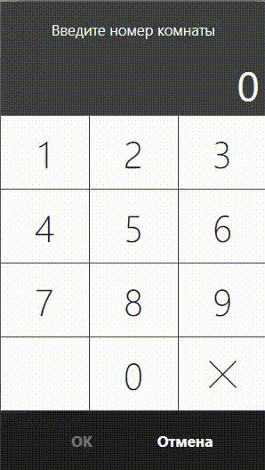

# Возможности ViewManager 
## «Точки входа» 
[`IViewManager`](http://iiko.github.io/front.api.sdk/v6/html/T_Resto_Front_Api_V6_UI_IViewManager.htm "IViewManager") позволяет показывать предопределённый набор встроенных в iikoFront диалоговых окон. Эта возможность доступна плагину, когда iikoFront в рамках модальной операции передаёт ему управление, вызывая соответствующий метод и передавая в него одним из аргументов экземпляр `IViewManager`. Данный объект актуален только в рамках метода, в который он приходит, и будет уничтожен, когда плагин вернёт управление из этого метода. 

Примеры модальных операций:

- [Вызов](http://iiko.github.io/front.api.sdk/v6/html/M_Resto_Front_Api_V6_UI_Button_PerformAction.htm "Button_PerformAction") обработчика нажатия на кнопку, [добавленную](http://iiko.github.io/front.api.sdk/v6/html/M_Resto_Front_Api_V6_IPluginIntegrationService_AddButton.htm "IPluginIntegrationService_AddButton") плагином в меню «Дополнения». 
- Взаимодействие с реализованным в плагине типом оплаты: процесс сбора данных, проведения и возврата оплаты (см. [`IExternalPaymentProcessor`](http://iiko.github.io/front.api.sdk/v6/html/Methods_T_Resto_Front_Api_V6_IExternalPaymentProcessor.htm "IExternalPaymentProcessor")) *(note: добавить ссылку на статью про оплаты после её написания)*

## Общий принцип
Плагин вызывает метод  и обрабатывает результат: `var result = viewManager.ShowSomething(...)`. В зависимости от сигнатуры конкретного метода плагин получит либо переменную примитивного типа (`bool`, `int`, `string`), либо экземпляр одной из реализаций [`IInputDialogResult`](http://iiko.github.io/front.api.sdk/v6/html/T_Resto_Front_Api_V6_Data_View_IInputDialogResult.htm "IInputDialogResult"), в зависимости от семантики.

Если бизнес-логика требует валидации введенного значения *(например, при вводе номера гостиничной комнаты нужно проверить, что такой номер есть в гостинице)*, то правильный подход такой:

- пользователь закрывает диалоговое окно,
- плагин валидирует результат, 
- если валидация не проходит, диалоговое окно показывается вновь.



Для уведомлений, не требующих явной реакции пользователя, рекомендуется использовать немодальные всплывающие окна (см. [notification](http://iiko.github.io/front.api.sdk/v6/html/M_Resto_Front_Api_V6_IOperationService_AddNotificationMessage_1.htm "IOperationService_AddNotificationMessage"), [warning](http://iiko.github.io/front.api.sdk/v6/html/M_Resto_Front_Api_V6_IOperationService_AddWarningMessage_1.htm "IOperationService_AddWarningMessage"),  [error](http://iiko.github.io/front.api.sdk/v6/html/M_Resto_Front_Api_V6_IOperationService_AddErrorMessage_1.htm "IOperationService_AddErrornMessage")), они не требуют экземпляра `IViewManager`, поэтому их можно показать в любой момент.    

## Описание доступных возможностей
### Диалог с двумя кнопками «Да»/«Нет»
`ShowYesNoPopup()` показывает диалоговое окно с заголовком, текстом и двумя кнопками и возвращает `true`, если нажали «Да».


### Диалог выбора элемента из списка
`ShowChooserPopup()` в качестве параметров принимает список строк и опционально индекс выбранного по умолчанию элемента, а возвращает индекс выбранного пользователем элемента. Имеет обёртку, принимающую список объектов и функцию получения текстового представления объекта `Func<T, string> `, опционально выбранный по умолчанию элемент, а возвращает выбранный пользователем элемент. Если элемент не был выбран пользователем *(нажата «Отмена»)*, возвращается `-1` или `null`. Необязательным параметром можно задать ширину кнопок в списке. Чем у́же одна кнопка, тем больше колонок с кнопками влезет на одну страницу. По умолчанию, кнопки имеют ширину `ButtonWidth.Normal`.


### Диалог ввода произвольных строк
`ShowKeyboard()` показывает диалоговое окно с экранной клавиатурой. Можно задать следующие параметры:

- начальный текст
- допускается ли многострочный ввод
- ограничение по длине вводимой строки
- нужно ли превращать первые буквы каждого вводимого слова в заглавные *(удобно для ввода имён собственных)*
- маскировать ли ввод *(если подразумевается ввод пароля)*
 


### Диалог ввода чисел 
Для ввода числа можно использовать `ShowInputDialog()` с параметром `type = InputTypes.Number` и опциональным параметром `initialValue` – начальное значение. Чтобы интерпретировать результат ввода, нужно привести возвращаемый `IInputDialogResult` к `NumberInputDialogResult`.


### Диалог ввода числовых строк
Кроме упомянутого выше метода, есть `ShowExtendedInputDialog()`. Одним из его параметров является класс настроек `ExtendedInputDialogSettings`. Если в нём задать `ExtendedInputDialogSettings.EnableNumericString = true` то пользователю будет предложено ввести цифры. Совместно с данной настройкой можно задать и поясняющий текст `ExtendedInputDialogSettings.TabTitleNumericString`. В отличие от упомянутого выше способа ввода, тут введённые данные представляют собой строку, что позволяет вводить «ведущие нули», а также большие числа, превышающие `int`. Чтобы интерпретировать результат ввода, нужно привести возвращаемый `IInputDialogResult` к `NumericStringInputDialogResult`.


Пример:
```cs
var settings = new ExtendedInputDialogSettings
{
    EnableNumericString = true,
    TabTitleNumericString = "Заголовок вкладки для ввода числа"
}
var dialogResult = viewManager.ShowExtendedInputDialog(
                "Заголовок окна", 
                "Подзаголовок, поясняющий что именно нужно ввести пользователю.",
                settings) 
    as NumericStringInputDialogResult;
if (dialogResult == null)
    return;
// analyze result
```

### Диалог ввода штрихкодов 
Метод `ShowExtendedInputDialog()` может быть вызван с настройкой `ExtendedInputDialogSettings.EnableBarcode = true`, которая идёт совместно с `ExtendedInputDialogSettings.TabTitleBarcode`. Чтобы интерпретировать результат ввода, нужно привести возвращаемый `IInputDialogResult` к `BarcodeInputDialogResult`.

### Диалог ввода номеров телефонов
Ещё одна настройка для `ShowExtendedInputDialog()` — это `ExtendedInputDialogSettings.EnablePhone = true`, которая идёт совместно с `ExtendedInputDialogSettings.TabTitlePhone`. В этом случае валидация вводимых пользователем данных будет происходить в соответствии с настройками в системе для телефонных номеров, в поле ввода будет маска с кодом страны. Пока введенные данные не будут валидными, нажать «OK» будет невозможно. Чтобы интерпретировать результат ввода, нужно привести возвращаемый `IInputDialogResult` к `PhoneInputDialogResult`.


### Диалоги с возможностью прокатки карт
Прокатку карт можно включить и в `ShowInputDialog()`, и в `ShowExtendedInputDialog()`. В первом случае нужно указать 
`type = InputTypes.Card`, во втором – `ExtendedInputDialogSettings.EnableCardSlider = true`. В обоих случаях, чтобы интерпретировать результат ввода, нужно привести возвращаемый `IInputDialogResult` к `CardInputDialogResult`.

### Дополнительно
Способы ввода в `ShowInputDialog()` и `ShowExtendedInputDialog()` можно комбинировать путём сочетания доступных настроек. Например, можно просить пользователя ввести номер или прокатать карту. В этом случае возвращаемый результат нужно будет пытаться приводить к каждому из ожидаемых типов результатов. 

Пример 1 (код):
```cs
var result = viewManager.ShowInputDialog(
    "Введите номер комнаты или прокатайте карту",
    InputDialogTypes.Number | InputDialogTypes.Card);

if (result is NumberInputDialogResult numeric)
    Operations.AddNotificationMessage($"Ввели номер {numeric.Number}", "SamplePlugin");
if (result is CardInputDialogResult card)
    Operations.AddNotificationMessage($"Карта с треком {card.FullCardTrack}", "SamplePlugin");
```
Пример 2 (возможный внешний вид и настройки):


```cs
var settings = new ExtendedInputDialogSettings
{
    EnableBarcode = true,
    TabTitleBarcode = "Заголовок вкладки штрихкодов",
    EnableCardSlider = true,
    EnableNumericString = true,
    TabTitleNumericString = "Заголовок вкладки для ввода числа", 
    EnablePhone = true,
    TabTitlePhone = "Ваш поясняющий текст телефону"
};
var dialogResult = viewManager.ShowExtendedInputDialog(
    "Заголовок окна", 
    "Подзаголовок, поясняющий что именно нужно ввести пользователю.",
    settings);
```

## Ещё кое-что о UI
Плагин может показывать свои собственные диалоговые окна, но это уже не является частью iikoFront Api. На эту тему есть [отдельная статья](CustomWindows.html "Кое-что о UI и .Net").
 
