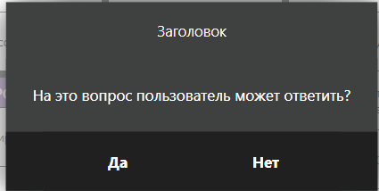
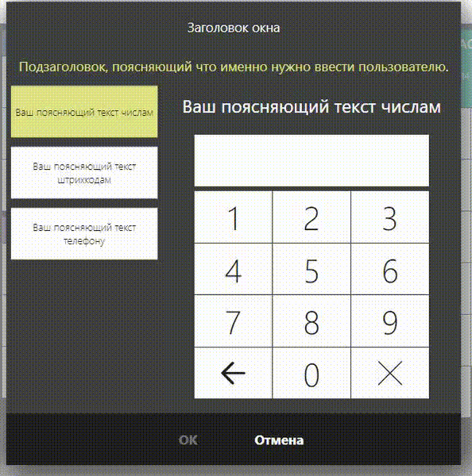

# Возможности IViewManager 
## «Точки входа» 
[`IViewManager`](http://iiko.github.io/front.api.sdk/v6/html/T_Resto_Front_Api_V6_UI_IViewManager.htm "IViewManager") позволяет показывать предопределённый набор встроенных в iikoFront диалоговых окон. Эта возможность доступна плагину, когда iikoFront в рамках модальной операции передаёт ему управление, вызывая соответствующий метод и передавая в него одним из аргументов экземпляр `IViewManager`. Данный объект актуален только в рамках метода, в который он приходит, и будет уничтожен, когда плагин вернёт управление из этого метода. 

Места, где управление передается от iikoFront в плагин:

- Встраивание кнопки в меню "Дополнения" (см. [`IPluginIntegrationService.AddButton()`](http://iiko.github.io/front.api.sdk/v6/html/M_Resto_Front_Api_V6_IPluginIntegrationService_AddButton.htm "IPluginIntegrationService_AddButton"),  [`Button.PerformAction()`](http://iiko.github.io/front.api.sdk/v6/html/M_Resto_Front_Api_V6_UI_Button_PerformAction.htm "Button_PerformAction")) 
- Взаимодействие с реализованным в плагине типом оплаты: процесс сбора данных, проведения и возврата оплаты (см. [`IExternalPaymentProcessor`](http://iiko.github.io/front.api.sdk/v6/html/Methods_T_Resto_Front_Api_V6_IExternalPaymentProcessor.htm "IExternalPaymentProcessor")) *(note: добавить ссылку на статью про оплаты после её написания)*

## Общий принцип
Вы вызываете метод `var result = viewManager.ShowSomeThing(...)` и обрабатываете результат. В зависимости от сигнатуры конкретного метода в результате вы получаете либо переменную примитивного типа (`bool`, `int`, `string`), либо экземпляр одной из реализаций [`IInputDialogResult`](http://iiko.github.io/front.api.sdk/v6/html/T_Resto_Front_Api_V6_Data_View_IInputDialogResult.htm "IInputDialogResult"), в зависимости от семантики.

Если вам требуется логика валидации введенного значения *(например, при вводе номера гостиничной комнаты нужно проверить, что такой номер есть в гостинице)*, то правильный подход в этом случае закрывать и показывать окно до тех пор, пока либо не будет корректное значение, либо пользователь не прервёт операцию.


Если вам нужно показать уведомительное сообщение пользователю, то рекомендуется использовать [`OperationService.AddNotificationMessage()`](http://iiko.github.io/front.api.sdk/v6/html/M_Resto_Front_Api_V6_IOperationService_AddNotificationMessage_1.htm "IOperationService_AddNotificationMessage") и аналоги. Во-первых, эти методы доступны из api в любой момент. Во-вторых, api iiko намеренно не предоставляет такой возможности, т.к. единственное, что может сделать пользователь в окне с одной кнопкой нажать эту единственную кнопку.    

## Описание доступных возможностей
### Диалог с двумя кнопками «Да»/«Нет»
`ShowYesNoPopup()` показывает окно с вашим текстом и двумя кнопками и возвращает `true` если нажали на «Да».



### Диалог выбора элемента из списка
`ShowChooserPopup()` в качестве параметров принимает список строк и опционально индекс выбранного по умолчанию элемента, а возвращает индекс выбранного элемента. Имеет extention, который принимает список объектов, функцию получения текстового представления объекта `Func<T, string> `, опционально выбранных по умолчанию элемент, а возвращает выбранный элемент. Если элемент не был выбран пользователем *(нажата «Отмена»)*, возвращается `-1` или `null`. Необязательным параметром можно задать ширину кнопок в списке. Соответственно, чем уже одна кнопка, тем больше колонок с кнопками влезет на одну страницу. По умолчанию параметр равен `ButtonWidth.Normal`.


### Диалог ввода произвольных строк
`ShowKeyboard()` показывает окно с экранной клавиатурой. Опциональными параметрами можно задать:

- начальный текст
- допускается ли многострочный ввод
- ограничение по длине вводимой строки
- нужно ли превращать первые буквы каждого вводимого слова в заглавные *(удобно для ввода имём собственных)*
- маскировать ли ввод *(если подразумевается ввод пароля)*
 


### Диалог ввода чисел 
Для ввода числа можно использовать `ShowInputDialog()` с параметром `type = InputTypes.Number` и опциональным параметром `initialValue` – начальное значение. Чтобы интерпретировать результат ввода, нужно привести возвращаемый `IInputDialogResult` к `NumberInputDialogResult`.


### Диалог ввода числовых строк
Кроме упомянутого выше метода, есть `ShowExtendedInputDialog()`. Одним из его параметров является класс настроек `ExtendedInputDialogSettings`. Если в нём задать `ExtendedInputSettings.EnableNumericString = true` то пользователю будет предложено ввести цифры. Совместно с данной настройкой, можно задать и поясняющий текст `ExtendedInputSettings.TabTitleNumericString`. Отличие от упомянутого выше способа ввода, тут введенные данные представляют собой строку. Это позволяет вводить «лидирующие нули», если этого требует бизнес-задача. Чтобы интерпретировать результат ввода, нужно привести возвращаемый `IInputDialogResult` к `NumericStringInputDialogResult`.


Пример:
```cs
var settings = new ExtendedInputDialogSettings
{
    EnableNumericString = true,
    TabTitleNumericString = "Ваш поясняющий текст числам"
};
var dialogResult = viewManager.ShowExtendedInputDialog(
                "Заголовок окна", 
                "Подзаголовок, поясняющий что именно нужно ввести пользователю.",
                settings) 
    as NumericStringInputDialogResult;
if (dialogResult == null)
    return;
// analize result
```

### Диалог ввода штрихкодов 
Ещё одна опция у настроек для `ShowExtendedInputDialog()` это `ExtendedInputSettings.EnableBarcode = true`, которая идёт совместно с `ExtendedInputSettings.TabTitleBarcode`. Фактически не нужен. Возможно, когда-нибудь на стороне iikoFront будет реализована и сканирование штрихкодов сканером *(RMS-48214)*. Но пока это просто числовая строка. В api две эти близких по сути опции добавлены исходя их бизнес-запросов клиента, которому нужно было вводить либо номер, либо штрихкод. Чтобы интерпретировать результат ввода, нужно привести возвращаемый `IInputDialogResult` к `BarcodeInputDialogResult`.

### Диалог ввода номеров телефонов
Ещё одна опция у настроек для `ShowExtendedInputDialog()` это `ExtendedInputSettings.EnablePhone = true`, которая идёт совместно с `ExtendedInputSettings.TabTitlePhone`. В этом случае валидация вводимых пользователем данных будет происходить в соответствии с настройками в системе для телефонных номеров, на форме будет маска с кодом страны и данные не будут считаться валидными пока не будет нужное количество символов. А пока введенные данные не будут валидными, нажать «OK» на форме будет невозможно. Чтобы интерпретировать результат ввода, нужно привести возвращаемый `IInputDialogResult` к `PhoneInputDialogResult`.


### Диалоги с возможностью прокатки карт
Прокатку карт можно включить и в `ShowInputDialog()` и в `ShowExtendedInputDialog()`. В первом случае нужно указать 
`type = InputTypes.Card`, во втором – `ExtendedInputSettings.EnableCardSlider = true`. В обоих случаях чтобы интерпретировать результат ввода, нужно привести возвращаемый `IInputDialogResult` к `CardInputDialogResult`.

### Note
Способы ввода в `ShowInputDialog()` и `ShowExtendedInputDialog()` можно комбинировать путём сочетания доступных настроек. Например, можно одновременно просить пользователя ввести номер и прокатать карту. В этом случае возвращаемый результат нужно будет пытаться приводить к каждому из ожидаемых типов результатов. 

Пример 1 (код):
```cs
var result = viewManager.ShowInputDialog(
    "Введите номер комнаты или прокатайте карту",
    InputDialogTypes.Number | InputDialogTypes.Card);

if (result is NumberInputDialogResult numeric)
    Operations.AddNotificationMessage($"Ввели номер {numeric.Number}", "SamplePlugin");
if (result is CardInputDialogResult card)
    Operations.AddNotificationMessage($"Карта с треком {card.FullCardTrack}", "SamplePlugin");
```
Пример 2 (возможный внешний вид и настройки):

```cs
var settings = new ExtendedInputDialogSettings
{
    EnableBarcode = true,
    TabTitleBarcode = "Ваш поясняющий текст штрихкодам",
    EnableCardSlider = true,
    EnableNumericString = true,
    TabTitleNumericString = "Ваш поясняющий текст числам", 
    EnablePhone = true,
    TabTitlePhone = "Ваш поясняющий текст телефону"
};
var dialogResult = viewManager.ShowExtendedInputDialog(
    "Заголовок окна", 
    "Подзаголовок, поясняющий что именно нужно ввести пользователю.",
    settings);
```

## Ещё кое-что о UI
Т.к. ваши плагины написаны на .net, вы вольны использовать любые средства, в том числе вы вправе показывать собственные окна. Теоретически, показывать свои окна вы можете в любой момент. Есть пара моментов, которые вам нужно иметь ввиду.

Во-первых, по умолчанию в процессе плагина нет STA-потока. Вам нужно его явно инициализировать. Пример кода:

```cs
ctor()
{
    var windowThread = new Thread(EntryPoint);
    windowThread.SetApartmentState(ApartmentState.STA);
    windowThread.Start();
}
...
private void EntryPoint()
{
    Window window = new MyWindow();
    window.ShowDialog();
}
```

Во-вторых, т.к. плагин это отдельный процесс, по умолчанию показанное из плагина окно не приобретает фокус. Фокус окну может дать только пользователь. Есть разные способы решить задачу форсированного назначения фокуса окну. Вот один из них:
```cs
public static void ClickWindow(Window wnd)
{
   try
   {
       var wih = new WindowInteropHelper(wnd);
       WinApi.RECT rect;
       WinApi.GetWindowRect(new HandleRef(wnd, wih.Handle), out rect);
       var x = rect.Left + (rect.Right - rect.Left) / 2;
       var y = rect.Top + (rect.Bottom - rect.Top) / 4;
       WinApi.LeftMouseClick(x, y);
   }
   catch (Exception) { }
}
```


