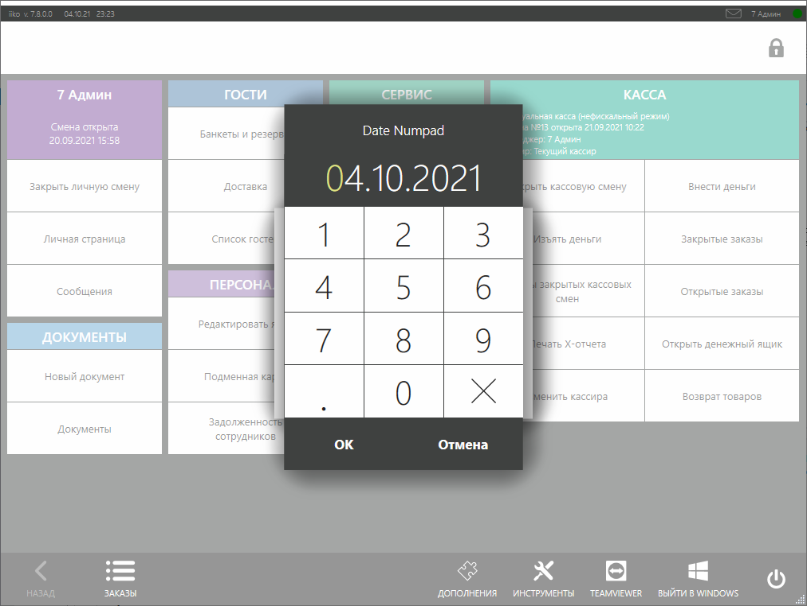
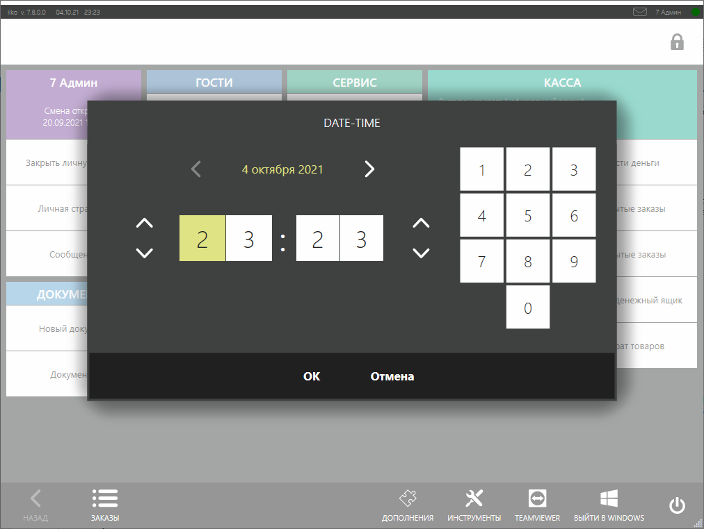
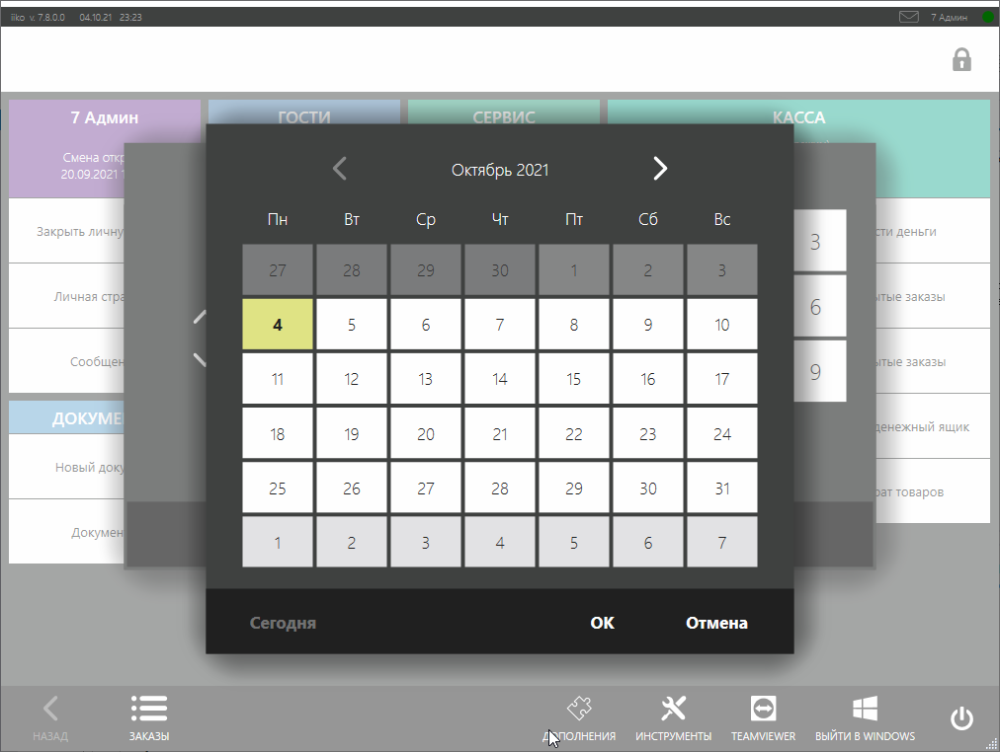
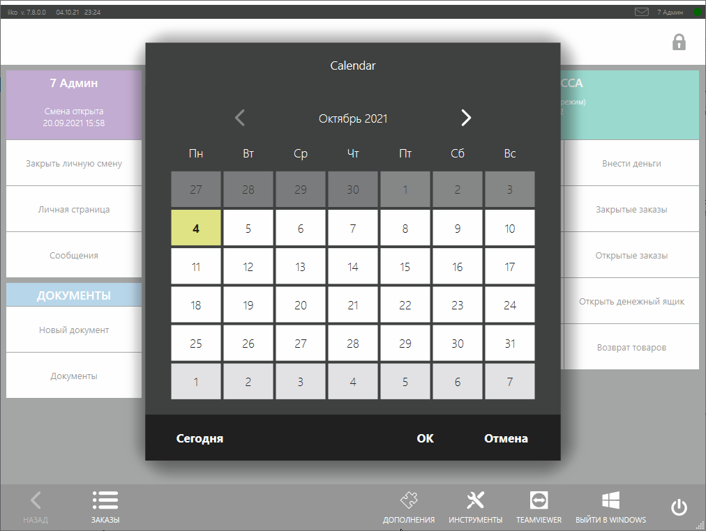

# Окна ввода даты и времени #

В процессе работы плагина может потребоваться запрос даты и времени. Для этого можно показать диалоговые окна с помощью методов [`DateTime? IViewManager.ShowDateNumpadPopup(DateTime selectedDate, string title)`](), [`DateTime? IViewManager.ShowDateTimePopup(DateTime selectedDate, string title, DateTime minDate, DateTime maxDate)`]() и [`DateTime? IViewManager.ShowCalendarPopup(DateTime selectedDate, string title, DateTime minDate, DateTime maxDate)`]().

## Как это выглядит в iikoFront?

В ряде случаев в процессе работы плагина ему доступен экземпляр класса [`IViewManager`](https://iiko.github.io/front.api.sdk/v7/html/T_Resto_Front_Api_UI_IViewManager.htm). Он доступен, например, при обработке нажатия на кнопку: 

```cs
PluginContext.Operations.AddButtonToPluginsMenu("Sample Plugin", x =>
{
    var viewManager = x.vm;
});
```

или срабатывании некоторых событий:

```cs
PluginContext.Notifications.BeforeOrderBill.Subscribe(x =>
{
	var viewManager = x.vm;
});
```

В таких случаях, можно с помощью [`IViewManager`](https://iiko.github.io/front.api.sdk/v7/html/T_Resto_Front_Api_UI_IViewManager.htm) показывать диалоговые окна. Рассмотрим все методы для запроса у пользователя даты и времени. Для примера, создадим кнопку с помощью метода [`IOperationService.AddButtonToPluginsMenu`](https://iiko.github.io/front.api.sdk/v7/html/M_Resto_Front_Api_IOperationService_AddButtonToPluginsMenu.htm), как это показано выше, и при нажатии на неё будем показывать диалоговые окна.

### Вариант 1: Date Numpad Popup

Можно запросить только дату с помощью простого диалога с цифровой клавиатурой:

```cs
PluginContext.Operations.AddButtonToPluginsMenu("Sample Plugin", x =>
{
    var dateNumpadPopupResult = x.vm.ShowDateNumpadPopup(DateTime.Today, "Date Numpad");
});
```

Таким образом, при нажатии на кнопку будет показано окно выбора даты:



Метод [`IViewManager.ShowDateNumpadPopup(DateTime selectedDate, string title)`]() принимает на вход 2 аргумента:

- `DateTime selectedDate` — дата, которая будет выбрана при показе окна.
- `string title` — заголовок окна.

Метод вернёт выбранную пользователем дату, если он нажмёт *«OK»*, либо `null`, если он нажмёт *«Отмена»*.

### Вариант 2: Date-Time Popup

Можно запросить дату и время с помощью диалога соответствующего диалога:

```cs
PluginContext.Operations.AddButtonToPluginsMenu("Sample Plugin", x =>
{
    var dateTimePopupResult = x.vm.ShowDateTimePopup(DateTime.Now, "Date-Time", DateTime.Today, DateTime.Today.AddMonths(6));
});
```

При нажатии на кнопку будет показано окно выбора даты и времени:



Если нажать на текущую дату, то будет показан календарь, с помощью которого можно быстро переключиться на другой день:



Метод [`IViewManager.ShowDateTimePopup(DateTime selectedDate, [CanBeNull] string title, DateTime minDate, DateTime maxDate)`]() принимает на вход 4 аргумента:

- `DateTime selectedDate` — дата и время, которые будут выбраны при показе окна.
- `string title` — заголовок окна.
- `DateTime minDate` — минимальные дата и время, которые могут быть выбраны. Свойство влияет и на календарь.
- `DateTime maxDate` — максимальные дата и время, которые могут быть выбраны. Свойство влияет и на календарь.

Метод вернёт выбранные пользователем дату и время, если он нажмёт *«OK»*, либо `null`, если он нажмёт *«Отмена»*.

### Вариант 1: Calendar Popup

Для выбора даты можно использовать окно с календарём:

```cs
PluginContext.Operations.AddButtonToPluginsMenu("Sample Plugin", x =>
{
    var dateCalendarPopupResult = x.vm.ShowCalendarPopup(DateTime.Today, "Calendar", DateTime.Today, DateTime.Today.AddMonths(6));
});
```

При нажатии на кнопку будет показано окно:



Метод [`IViewManager.ShowCalendarPopup(DateTime selectedDate, [CanBeNull] string title, DateTime minDate, DateTime maxDate)`]() принимает на вход 4 аргумента:

- `DateTime selectedDate` — дата, которая будет выбрана при показе окна.
- `string title` — заголовок окна.
- `DateTime minDate` — минимальная дата, которая может быть выбрана.
- `DateTime maxDate` — максимальная дата, которая может быть выбрана.

Метод вернёт выбранную пользователем дату, если он нажмёт *«OK»*, либо `null`, если он нажмёт *«Отмена»*.